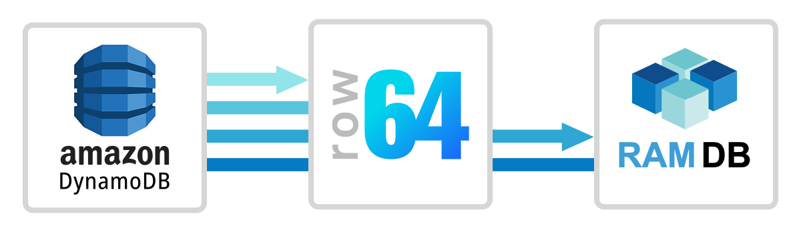
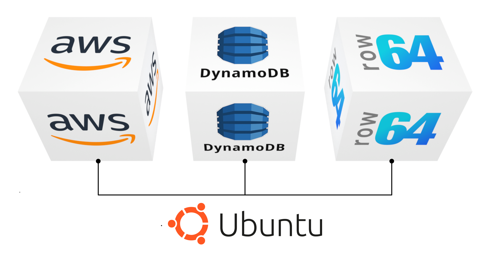
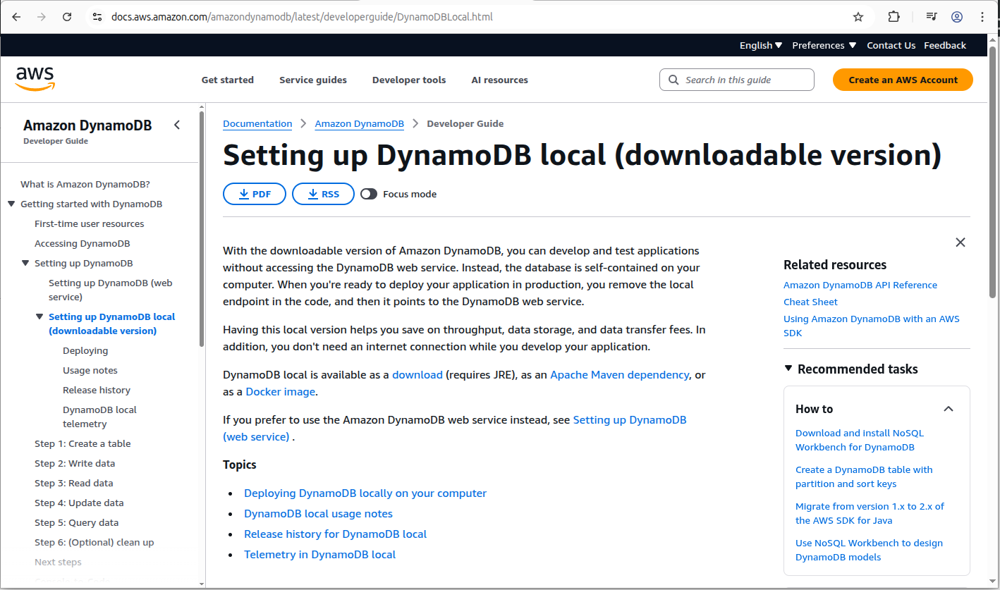
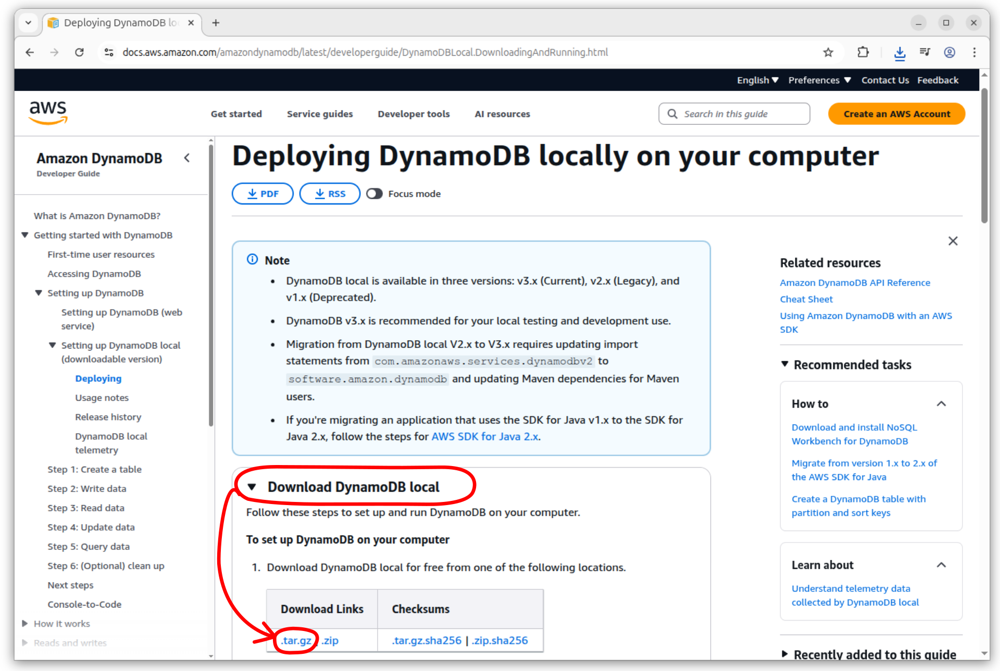
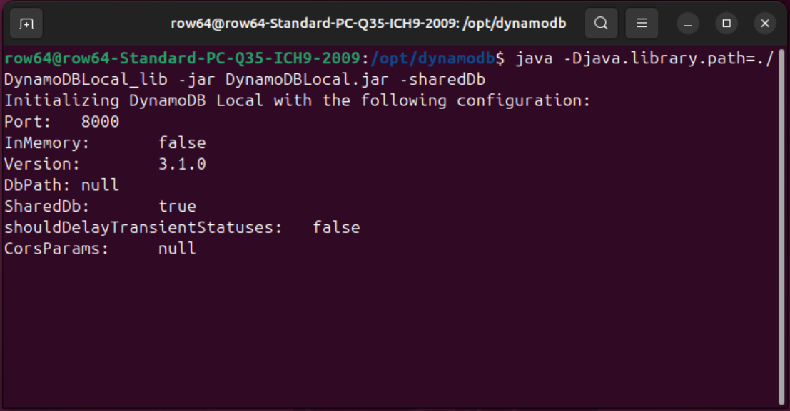
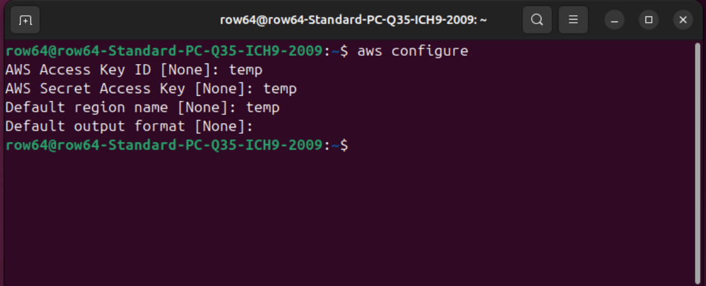
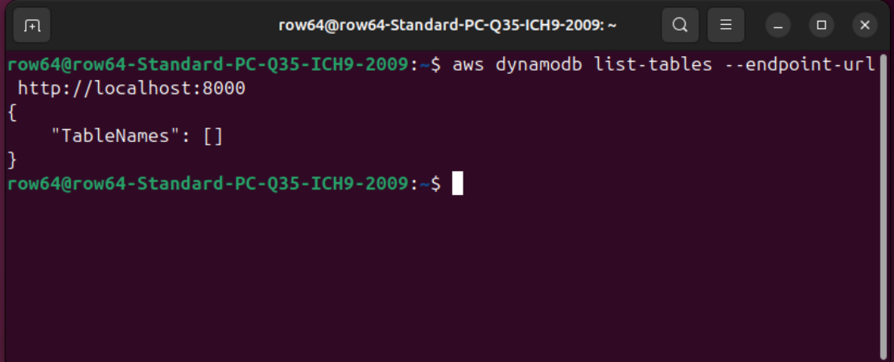
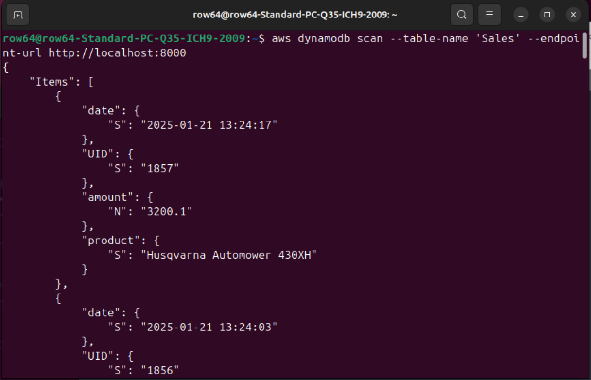
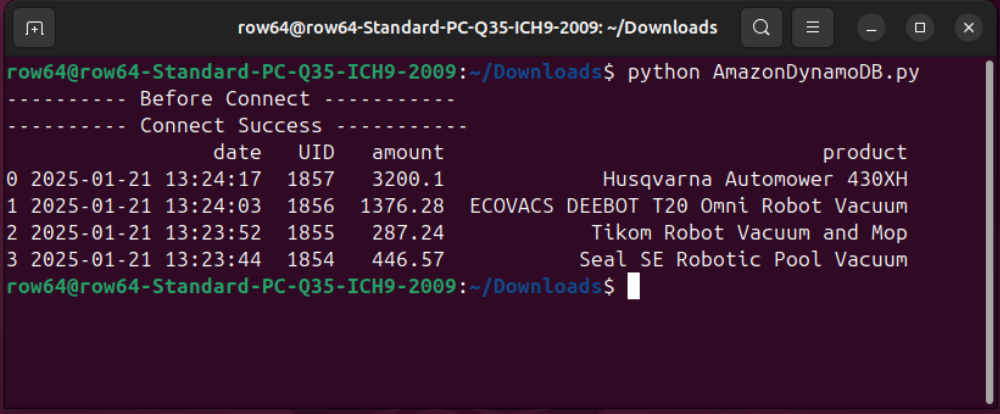
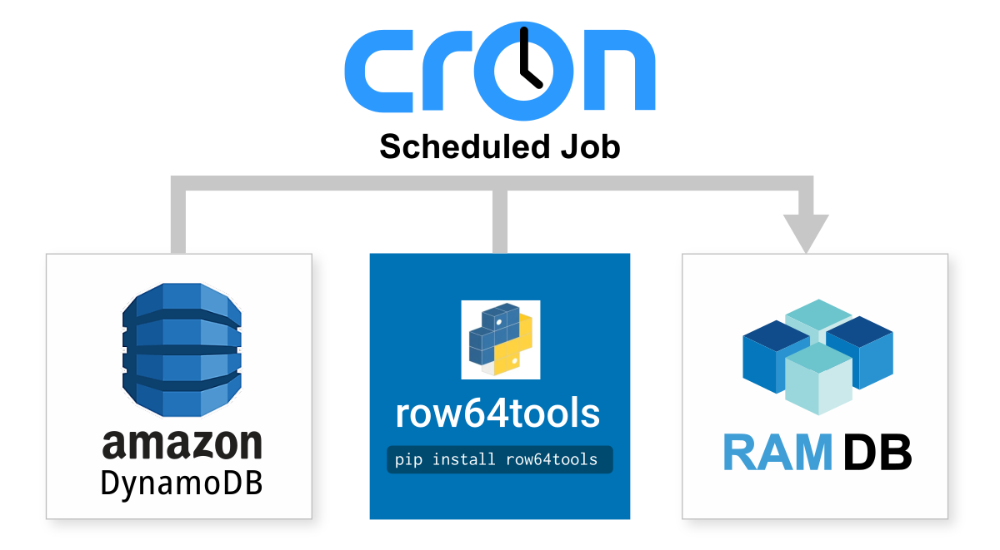

# Amazon DynamoDB Integration



Amazon DynamoDB is a serverless, key-value NoSQL, document-oriented database service on AWS.  It is designed to be flexible and highly scalable.  Amazon DynamoDB integrates easily with Row64 by wiring to Row64 RamDb through Python.


## Integration Overview

This guide outlines the simplest possible setup for integrating Amazon DynamoDB with Row64. This setup will utilize a single instance or server to install both Row64 Server and DynamoDB.




<!-- ### Test Locally (Optional)

Amazon offers a workflow that allows users to test DynamoDB without accessing the web service, which allows for convenient experimentation. If you are interested in testing a localized version of DynamoDB before proceeding, you can get started at:

* [https://docs.aws.amazon.com/amazondynamodb/latest/developerguide/DynamoDBLocal.html](https://docs.aws.amazon.com/amazondynamodb/latest/developerguide/DynamoDBLocal.html)

<br>

 -->


## Download Row64 Server

The first step is to install Row64 Server to your instance of Ubuntu. If you do not already have Row64 Server set up, please refer to the following documentation to install Row64 Server on Ubuntu. Once you have it set up, return to this guide to proceed.

* [Row64 Server Ubuntu](../../V3_5/Install_Docs/Server/Server_Install_Ubuntu.md)

<!-- https://app.row64.com/Help/V3_5/Install_Docs/Server/Server_Install_Ubuntu/ -->


## Set Up DynamoDB

This section explains how to download, install, and start a local instance of DynamoDB.


### Prepare Java

Java is required to proceed. Install Java on your instance of Ubuntu by executing the following commands, line-by-line:

```
sudo apt update
sudo apt upgrade -y
sudo apt install openjdk-17-jdk -y
```


### Download DynamoDB

Use the following link to download the latest version of DynamoDB. In the "Download DynamoDB local" category, find the download links and download the `.tar.gz`.

* [https://docs.aws.amazon.com/amazondynamodb/latest/developerguide/DynamoDBLocal.DownloadingAndRunning.html#DynamoDBLocal.DownloadingAndRunning.title](https://docs.aws.amazon.com/amazondynamodb/latest/developerguide/DynamoDBLocal.DownloadingAndRunning.html#DynamoDBLocal.DownloadingAndRunning.title)




### Install DynamoDB

Now that Java is installed and you downloaded the DynamoDB files, you can proceed with installing DynamoDB.

First, you will need to create a new directory, called `dynamodb`, in `/opt`. Then, you will move the DynamoDB files from the default download location to the `dynamodb` directory.

Assuming the DynamoDB files downloaded to your `Downloads` folder, use the following commands to create the `/opt/dynamodb` directory and move the files from `Downloads` to `/opt/dynamodb`:

```
sudo mkdir /opt/dynamodb
sudo mv ~/Downloads/dynamodb_local_latest.tar.gz /opt/dynamodb
```

Next, extract the tar:

```
cd /opt/dynamodb
sudo tar xzvf dynamodb_local_latest.tar.gz
```

### Update Permissions

This guide assumes that the current user account is called `row64`. Since the installations are under the user account, you need to give ownership over the `dynamo` directory to the `row64` user:

```
sudo chown -R row64:row64 /opt/dynamodb
```


### Start DynamoDB

Navigate the terminal to the `dynamodb` directory and start the server:

```
cd /opt/dynamodb
java -Djava.library.path=./DynamoDBLocal_lib -jar DynamoDBLocal.jar -sharedDb
```

After starting DynamoDB, the terminal will output some basic information:



Note that DynamoDB runs on port 8000 by default. You will use this port number to connect to the Python integration later in this guide.

For now, leave the terminal open that's running DynamoDB. In the next section, you'll simply open a second terminal without closing the existing one.

!!! tip
    Make sure you're in the correct directory when trying to start DynamoDB.


## Local Configuration

This section describes how to set up the AWS command line interface (CLI) and configure the local connection.


### Install the AWS CLI

Open a second terminal and install the AWS CLI using the following command:

```
sudo apt install awscli -y
```


### Establish the Local Connection

This tutorial uses a local connection, so rather than using the configure tool to enter online account information, you will use stand-in data. This approach is required to successfully establish a local-only connection.

Enter the following command into the second terminal:

```
aws configure
```

Enter "temp" for the first three questions and leave the last one blank.

```
temp
temp
temp
<enter>
```



Optionally, you could use your Amazon access credentials to complete the configuration as well.

Next, list the tables with the following command:

```
aws dynamodb list-tables --endpoint-url http://localhost:8000
```

The table list should currently be blank.




### Create an Example Table

Since the table list is blank, you will need to create a new table that can be used to test Row64. Use the following command to create a new table, called `Sales`:

```
aws dynamodb create-table \
    --table-name Sales \
    --attribute-definitions AttributeName=UID,AttributeType=S \
    --key-schema AttributeName=UID,KeyType=HASH \
    --provisioned-throughput ReadCapacityUnits=5,WriteCapacityUnits=5 \
    --endpoint-url http://localhost:8000
```

List the tables again to see if the new `Sales` table is present:

```
aws dynamodb list-tables --endpoint-url http://localhost:8000
```

You should see the `Sales` table in the list.


### Input Sample Data

The `Sales` table does not yet contain any data. Input some sample data into the table, entering the following commands into the terminal one at a time:

```
aws dynamodb put-item --table-name 'Sales' --item '{"UID":{"S":"1854"},"date":{"S":"2025-01-21 13:23:44"},"amount": {"N": "446.57"},"product": {"S": "Seal SE Robotic Pool Vacuum"}}' --endpoint-url http://localhost:8000
```

```
aws dynamodb put-item --table-name 'Sales' --item '{"UID":{"S":"1855"},"date":{"S":"2025-01-21 13:23:52"},"amount": {"N": "287.24"},"product": {"S": "Tikom Robot Vacuum and Mop"}}' --endpoint-url http://localhost:8000
```

```
aws dynamodb put-item --table-name 'Sales' --item '{"UID":{"S":"1856"},"date":{"S":"2025-01-21 13:24:03"},"amount": {"N": "1376.28"},"product": {"S": "ECOVACS DEEBOT T20 Omni Robot Vacuum"}}' --endpoint-url http://localhost:8000
```

```
aws dynamodb put-item --table-name 'Sales' --item '{"UID":{"S":"1857"},"date":{"S":"2025-01-21 13:24:17"},"amount": {"N": "3200.10"},"product": {"S": "Husqvarna Automower 430XH"}}' --endpoint-url http://localhost:8000
```

After the data is entered, print the contents of the table to the terminal to view the data:

```
aws dynamodb scan --table-name 'Sales' --endpoint-url http://localhost:8000
```




!!! tip
    You can hold down the ENTER key to scroll through the data.


## Prepare Python

For working with Python in Ubuntu, when you need to perform pip installations, it's best practice to install a second instance of Python. This will prevent pip dependencies from corrupting Ubuntu system calls.

The simplest way to manage multiple versions of Python is to use `pyenv`, which you will set up in the next section. For further reading, if you would like to learn more about `pyenv`, you can reference the following article:

* [https://realpython.com/intro-to-pyenv/](https://realpython.com/intro-to-pyenv/)


### Install pyenv

To simplify the setup, we've automated the `pyenv` installation.  From the root of the integration in GitHub, download the `Setup_pyenv.py` file.

* [https://github.com/Row64/Row64_Integrations/tree/master](https://github.com/Row64/Row64_Integrations/tree/master)

Once downloaded, use the following command to run the setup script:

```
python3 Setup_pyenv.py
```

With `pyenv` set up, you are enabled to safely install the needed pip libraries for the Python integration.


### Install Python Pip Libraries

Install the Python libraries used to connect to the database and transfer a `.ramdb` file.  In the terminal, enter the following commands one at a time:

```
pip install row64tools
```

```
pip install python-dotenv
```

```
pip install boto3
```

```
pip install paramiko
```

```
pip install scp
```

## Create the Loading Folder

You will need a folder to store and load the `.ramdb` files into Row64 Server. For further reading, you can learn more about how `.ramdb` files are loaded at the following article:

In this example, `.ramdb` files will be loaded into a `Temp` folder in Row64. Create the new `Temp` directory as the `row64` user. (Row64 Server needs to have been installed prior to this step). Use the following command to create the loading folder:

```
mkdir -p /var/www/ramdb/loading/RAMDB.Row64/Temp
```

!!! note
    In this example, since you are installing DynamoDB and Row64 Server on the same instance, you don't have to set up SSH. If you want to modify your configuration so that these are on separate instances, however, you will need to configure SSH transfers.

    To set up SSH, you can reference another integration page that uses SSH, such as MongoDB. Check out the SSH setup section of the MongoDB page to learn how to configure SSH:

    [MongoDB Integration](MongoDB.md#set-up-ssh-on-ubuntu)

    <!-- https://app.row64.com/Help/Integrations_Docs/Integration_List/MongoDB/ -->

    The .py file for the MongoDB integration also provides a simple code example.


## Prepare and Run the Integration

Download the Row64 integration for DynamoDB from GitHub. Specifically, download the `AmazonDynamoDB.py` file:

* [https://github.com/Row64/Row64_Integrations/tree/master/AmazonDynamoDB](https://github.com/Row64/Row64_Integrations/tree/master/AmazonDynamoDB)

Navigate the terminal to the integration's directory.

Run the Python integration:

```
python AmazonDynamoDB.py
```

If everything worked, the terminal should state that the connection was successful, and it should output some sample data:




## Test with ByteStream Viewer

Once you see the file copy over to Ubuntu, you can install ByteStream Viewer to visualize the data. To install ByteStream Viewer on Ubuntu, you can reference the following documentation:

* [Install ByteStream Viewer on Ubuntu](../../V3_5/Install_Docs/Streaming/Stream_Install_Ubuntu.md/#install-bytestream-viewer)

You can drag and drop the `.ramdb` file directly into ByteStream Viewer to open it quickly.


Alternatively, you can simply open the file in Row64 Studio.


## Continual Updates

Cron jobs are the simple and production-proven Linux tool for continual updates. The following article provides a simple example on how to set them up:

* [https://www.geeksforgeeks.org/linux-unix/how-to-setup-cron-jobs-in-ubuntu/](https://www.geeksforgeeks.org/linux-unix/how-to-setup-cron-jobs-in-ubuntu/)

All you need to do is take the integration .py file and set up a cron job to run it at your data refresh rate, from every day to every 20 seconds.



If your update rate is faster than 60 seconds, be sure to update your row64 config in:

```
/opt/row64server/conf/config.json
```

Modify "RAMDB_UPDATE" to match the desired update speed.

