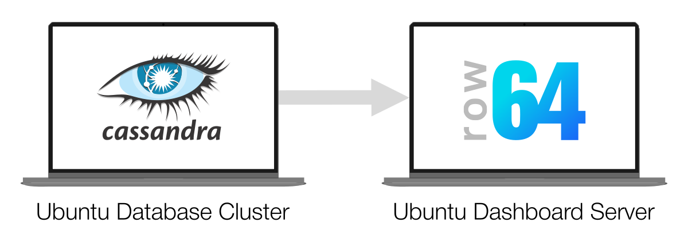
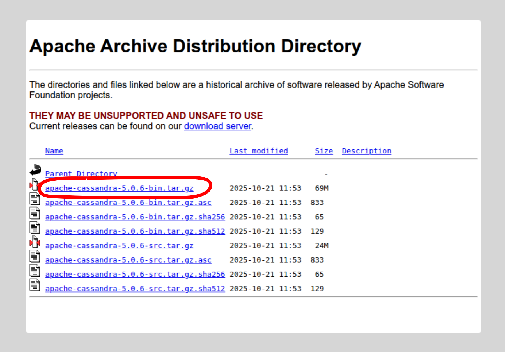
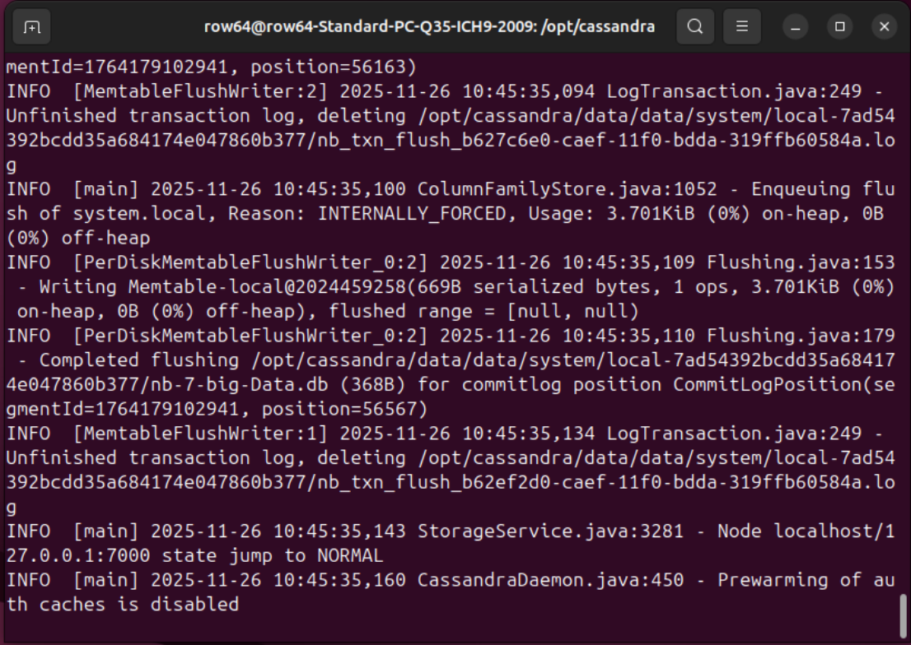
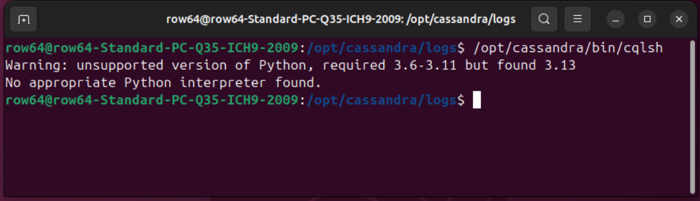
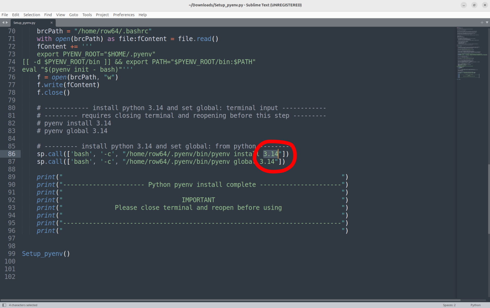
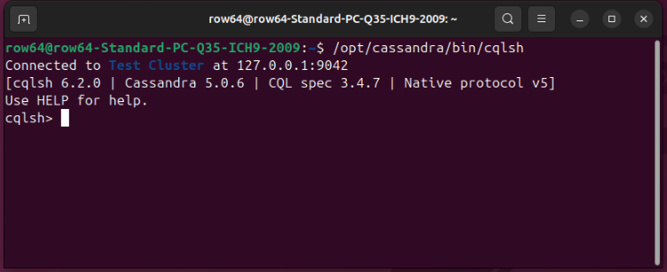
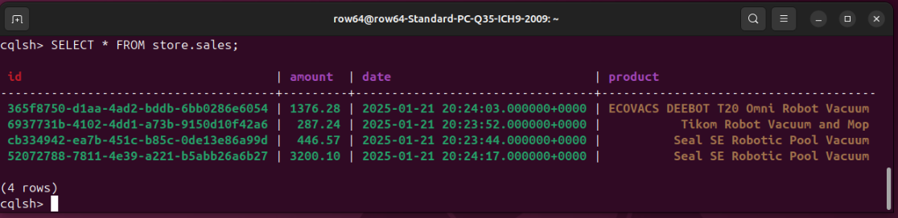
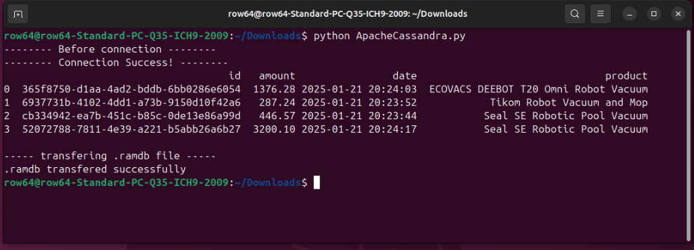
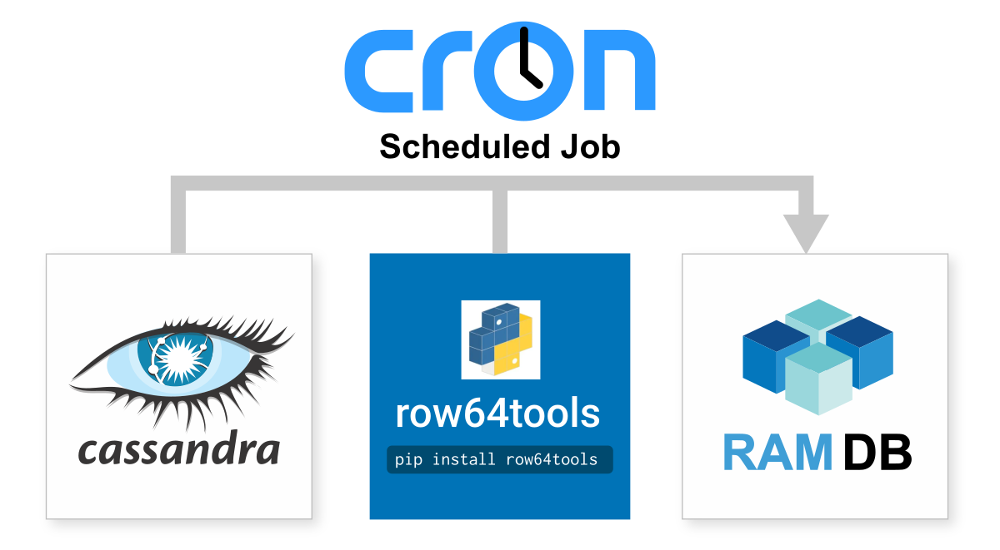

# Apache Cassandra Integration


Apache Cassandra is an open-source, distributed NoSQL, highly scalable, and partitioned database. It is designed to handle large data volumes across servers. Apache Cassandra integrates easily with Row64 by wiring to Row64 RamDb through Python.


## Integration Overview

In this integration example, you will need to set up two separate servers or instances. The first instance will be a minimal Cassandra setup on Ubuntu 25.1, and the second will host Row64 Server on Ubuntu 25.1.



Python will be used to read an example table from the Cassandra instance and transfer it to the Row64 Server using SSH.

To get started, you will need to set up Row64 Server. If you do not already have an instance of Row64 Server, please refer to the following documentation to set it up. Leave the Row64 Server settings to their default values. Once it's working, return to this page to proceed with the integration.

* [Ubuntu Server](../../V3_5/Install_Docs/Server/Server_Install_Ubuntu.md)

<!-- https://app.row64.com/Help/V3_5/Install_Docs/Server/Server_Install_Ubuntu/ -->

For the server or instance that will host Cassandra, simply begin with a fresh installation of Ubuntu 25.1. While this guide provides the necessary information for setting up a working instance, you may refer to the following article for a supplementary reference, if needed:

* [https://cassandra.apache.org/doc/latest/cassandra/installing/installing.html](https://cassandra.apache.org/doc/latest/cassandra/installing/installing.html)

!!! note
    Unless otherwise specified, the steps in this guide should be performed on the server or instance that will host Cassandra (the Ubuntu database cluster), not on the dashboard server.


## Install Cassandra

Before you can install Cassandra, you need to install Java. Use the following commands in a terminal:

```
sudo apt update
sudo apt upgrade -y
sudo apt install openjdk-17-jdk -y
```

Once Java is successfully installed, find and download the latest version of Cassandra from the following website:

* [https://archive.apache.org/dist/cassandra/](https://archive.apache.org/dist/cassandra/)

At the time of writing, the most recent version is 5.0.6. You don't need the source code, so just download the binary:



Download the latest binary. Find the downloaded folder and move it to the /opt directory. Assuming the binary downloaded to your Downloads directory, use the following command to move it to /opt:

```
sudo mv ~/Downloads/apache-cassandra-5.0.6-bin.tar.gz /opt
```

Next, extract the file:

```
cd /opt
sudo tar xzvf apache-cassandra-5.0.6-bin.tar.gz
```

Keep things simple by renaming the folder with smaller names:

```
sudo mv apache-cassandra-5.0.6 cassandra
```

You now need to grant ownership of the folder to the current user. This example assumes that you're performing the installations as a user named `row64`, but this is not strictly required; if you are using a different user, modify the following command accordingly. Update the ownership:

```
sudo chown -R row64:row64 cassandra
```

Now, start Cassandra:

```
cd /opt/cassandra/
bin/cassandra
```

After starting Cassandra, the terminal should output information about the server's status.



Open another terminal. You can access the Cassandra log at any time with the following command:

```
tail -f /opt/cassandra/logs/system.log
```

You can check the status with:

```
/opt/cassandra/bin/nodetool status
```


## Connect to Cassandra

Launch the terminal editor for Cassandra with:

```
/opt/cassandra/bin/cqlsh
```

When you run this command, it will likely tell you that it needs a different version of Python.



Take note of the version range that's needed. In this example, the version range was:

```
Python 3.6-3.11
```

You will download the needed version of Python in a following section. For now, simply take note of the range you need.


## Download Cassandra Integration

Download the Row64 integration for Cassandra from GitHub. The following link will direct you to the general Integrations page, where you can find all Row64 integrations. Locate and download the *ApacheCassandra* folder:

* [https://github.com/Row64/Row64_Integrations](https://github.com/Row64/Row64_Integrations)

You will need the integrations files for a later section in this guide. For now, simply download the content and continue to the next section.


## Set Up a Non-OS Python

In this section, you will need to edit files using a text editor. Use the following command to download Sublime, which you will use to accomplish the needed tasks:

```
sudo snap install sublime-text --classic
```

For working with Python in Ubuntu, when you need to perform pip installations, it's best practice to install a second instance of Python. This will prevent pip dependencies from corrupting Ubuntu system calls. For your second instance of Python, you will need to find a version that is within Cassandra's requirements.

To simplify the setup, we've automated the `pyenv` installation.  From the root of the integration in [GitHub](https://github.com/Row64/Row64_Integrations/tree/master), download the `Setup_pyenv.py`.

The `Setup_pyenv.py` script installs Python 3.14, but you will need to modify it to match the highest version that Cassandra supports. In this example, the highest version noted from earlier was `3.11`. Open the `Setup_pyenv.py` script in Sublime and modify it to download the needed version of Python, rather than the default 3.14. Refer to the following screenshot:



After successfully modifying the targeted version of Python, run the script using the following command:

```
python3 Setup_pyenv.py
```

Once `pyenv` is set up, you can work with the folder specific to the integration to install the needed pip libraries and Python integration, calling `python` instead of the OS-level `python3`.


## Set Up Example Database and Table

The Cassandra Query Language (CQL) is very similar to SQL.

Now that the correct version of Python is installed, you can launch the Terminal CQL Editor by using the following command in a regular terminal:

```
/opt/cassandra/bin/cqlsh
```



Create a keyspace, which is the layer at which Cassandra replicates its data. In CQL, type:

```
CREATE KEYSPACE IF NOT EXISTS store WITH REPLICATION = { 'class': 'SimpleStrategy', 'replication_factor' : '1'};
```

Next, create a table for some example data:

```
CREATE TABLE IF NOT EXISTS store.sales (id UUID, date TIMESTAMP, amount DECIMAL, product TEXT, PRIMARY KEY (id));
```

Now, add some data into the table. Enter the following lines one-by-one:

```
INSERT INTO store.sales (id, date, amount, product) VALUES (uuid(), '2025-01-21 13:23:44', 446.57, 'Seal SE Robotic Pool Vacuum');
```

```
INSERT INTO store.sales (id, date, amount, product) VALUES (uuid(), '2025-01-21 13:23:52', 287.24, 'Tikom Robot Vacuum and Mop');
```

```
INSERT INTO store.sales (id, date, amount, product) VALUES (uuid(), '2025-01-21 13:24:03', 1376.28, 'ECOVACS DEEBOT T20 Omni Robot Vacuum');
```

```
INSERT INTO store.sales (id, date, amount, product) VALUES (uuid(), '2025-01-21 13:24:17', 3200.10, 'Husqvarna Automower 430XH');
```

Print out the contents of the table to the terminal using the following command in the CSQL prompt:

```
SELECT * FROM store.sales; 
```



Cassandra does a nice job of displaying tables in the terminal. Also, notice how the data types are color-coded; red is for the primary key, green is for numbers, and brown is for text.

Finally, exit the CSQL terminal with:

```
EXIT
```


## Install Pip Libraries

Before you can configure the Apache Cassandra integration and transfer a .ramdb file, you need to install additional pip libraries. Run the following commands:

```
pip install row64tools
pip install python-dotenv
pip install cassandra-driver
pip install paramiko
pip install scp
```


## Set Up .env For Security

Next, set up a `.env` file to separate the login credentials from the `.py` files. If you're interested in learning more about how `.env` files work, additional details are available at:

* [https://pypi.org/project/python-dotenv/](https://pypi.org/project/python-dotenv/)

First, you will need a new directory to store the `.env` file in, which should be organized under the user account. This guide assumes that the user account is named `row64`, so if you are using a different name, update the paths accordingly.

```
mkdir /home/row64/r64tools
```

In addition to the `.env` file, this guide will also use this directory for the `.ramdb` files. This is only an example setup, however, so you can modify the file paths to fit your needs in a production environment.

Next, create the `.env` file. Use the following command to simultaneously create and open a new file called `db.env` in Sublime. The following command will automatically create the file when it discovers that it does not already exist at the specified location:

```
subl /home/row64/r64tools/db.env
```

With the file open in Sublime, input your SSH credentials to transfer files to Row64 Server. This example uses dummy values, so change the SSH values according to your setup:

```
SSH_Host=192.168.1.10
SSH_Port=22
SSH_User=row64
SSH_Pwd=temp7
```

The SSH values contain the login information to your server or instance that hosts Row64 Server, which you want to copy the file to.

Also, it is important to set up SSH with a user account that has access to the dashboards (i.e., `row64`) so that the files can be successfully transferred and loaded.


## Networking and SSH Setup

!!! note
    Complete the steps in this section on the receiving server or instance, which is the instance that hosts Row64 Server.

On the *receiving* server or instance, if you only completed the default Ubuntu installation, SSH will likely need to be manually installed.

First, check if OpenSSH is already installed. In Ubuntu, check the list of installed UFW profiles with:

```
sudo ufw app list
```

If OpenSSH is not listed, install it with:

```
sudo apt install openssh-server
```

Enable SSH connections and the firewall:

```
sudo ufw allow OpenSSH
sudo ufw enable
```

!!! tip
    This integration routes a SSH login and password in the example .py file.  The setup can be modified for a higher tier of security using a SSH key, which is an access credential in the SSH protocol.


## Run the Integration

In an [earlier step](#download-cassandra-integration), you should have downloaded the Cassandra integration from GitHub to the instance or server hosting Cassandra (not the dashboard server). This integration consists of a directory called *ApacheCassandra* and contains a .py file named `ApacheCassandra.py`. Open a terminal at (or navigate the terminal to) the .py file's location, and run the file by using the following command:

```
python ApacheCassandra.py
```



If the integration was successful, after running the file, you should see:

* The dataframe print to the terminal

* A message that states that the .ramdb file transferred successfully


## Troubleshoot if Needed

In the event that you need to troubleshoot the connection, this section provides some tips that might help you identify the potential issue.


### Receiving Folder and Permissions

Before attempting to transfer the file from your database to the dashboard server, you must have a directory to receive it, which should be made in advance. The user account (i.e., `row64`) also needs proper access to the receiving directory.

For example, on the receiving server or instance, if you attempt to copy the file to:

```
/var/www/ramdb/live/RAMDB.Row64/Temp/Test.ramdb
```

Ensure that:

* You already made the folder in Linux

* You copy the file so that the dashboard (user: row64) has access to it


### Debug SSH to Ubuntu

If the .ramdb file didn't copy over to Row64 Server, debug the port connections with `ping` and `telnet`. In the following commands, substitute the example IP addresses (192.168.1.10) with your own hostnames or IPs:

Ping:
```
ping 192.168.1.10
```

Telnet:
```
telnet 192.168.1.10 22
```

For reference, the following article discusses resolving these issues:

* [https://stackoverflow.com/questions/14143198/errno-10060-a-connection-attempt-failed-because-the-connected-party-did-not-pro](https://stackoverflow.com/questions/14143198/errno-10060-a-connection-attempt-failed-because-the-connected-party-did-not-pro)


## Test with ByteStream Viewer

Once you see the file copy over to Ubuntu, you can install ByteStream Viewer to visualize the data.

To install ByteStream Viewer on Ubuntu, you can reference the following documentation:

* [Install ByteStream Viewer on Ubuntu](../../V3_5/Install_Docs/Streaming/Stream_Install_Ubuntu.md/#install-bytestream-viewer)

You can drag the .ramdb file right into the ByteStream Viewer


Alternatively, you can simply open the file in Row64 Studio.


## Continual Updates

Cron jobs are the simple and production-proven Linux tool for continual updates.

The following article provides a simple example on how to set them up:

* [https://www.geeksforgeeks.org/linux-unix/how-to-setup-cron-jobs-in-ubuntu/](https://www.geeksforgeeks.org/linux-unix/how-to-setup-cron-jobs-in-ubuntu/)

All you need to do is take the integration .py file and set up a cron job to run it at your data refresh rate, from every day to every 20 seconds.



If your update rate is faster than 60 seconds, be sure to update your row64 config in:

```
/opt/row64server/conf/config.json
```

Update "RAMDB_UPDATE" to match the update speed.