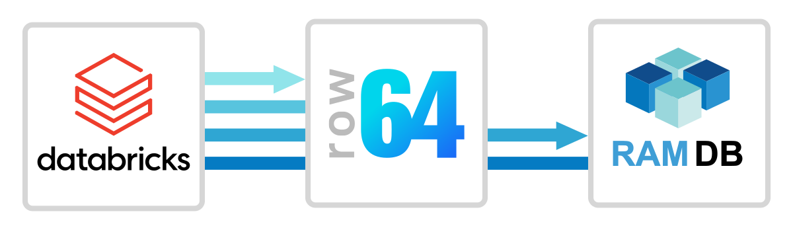
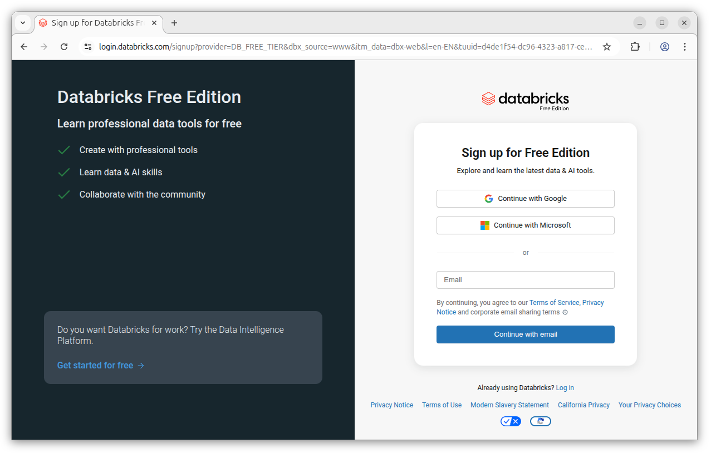
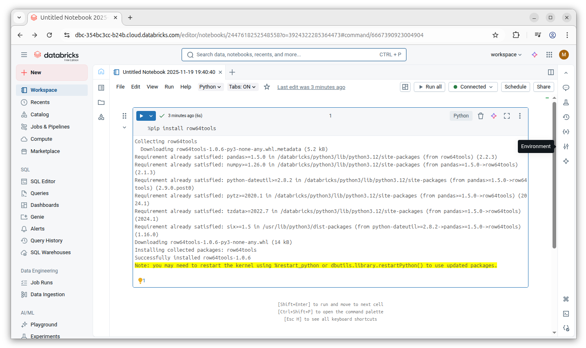
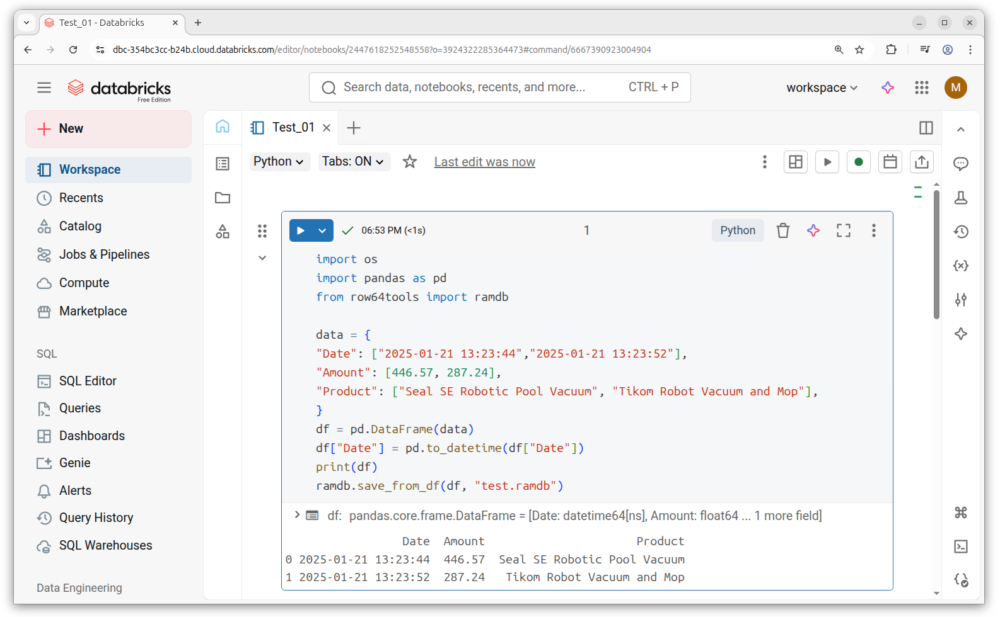
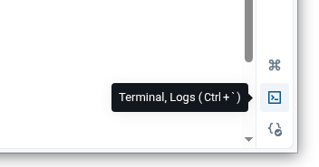
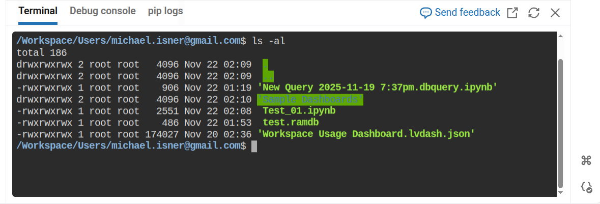
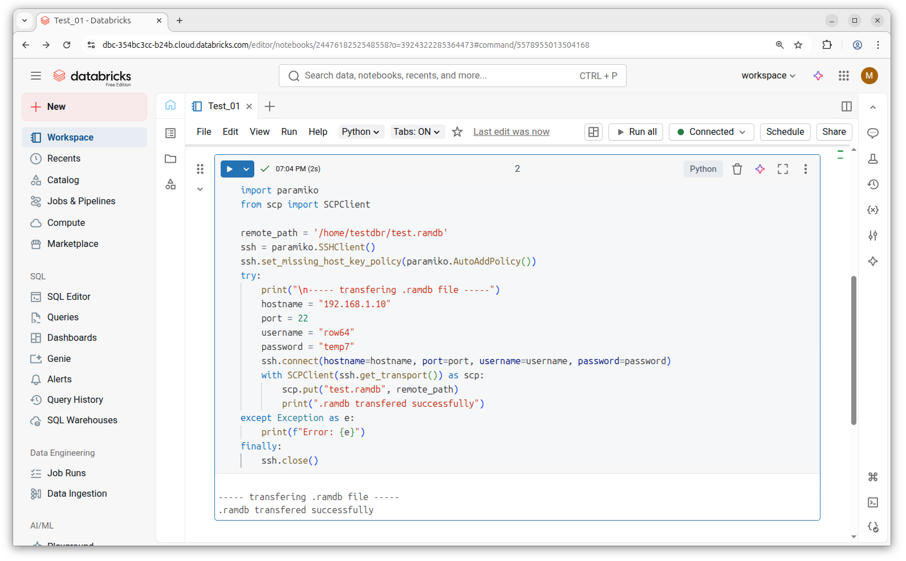
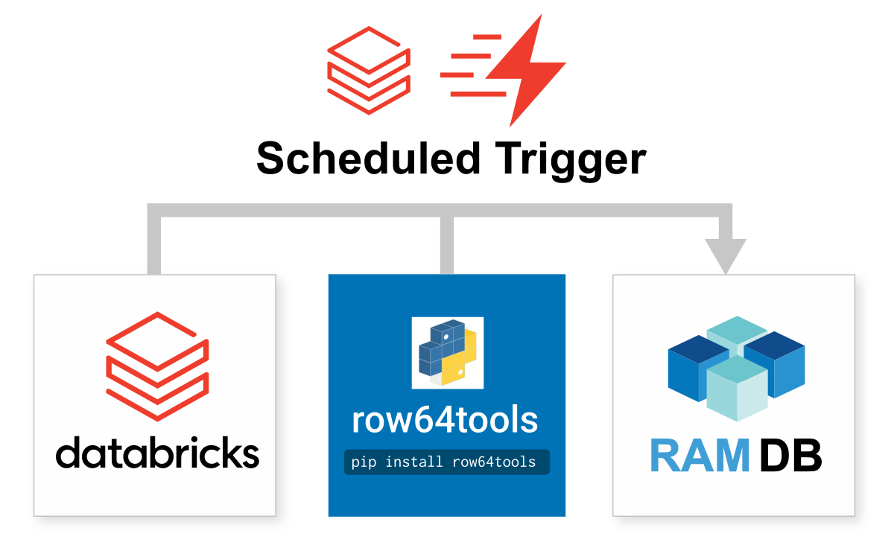

# Databricks Integration



Databricks is one of the most popular platforms for analytics. It's a cloud-based service that manages Apache Spark clusters, and is both powerful and easy to use.  Databricks integrates easily with Row64 by wiring to Row64 RamDb through Python.


## Integration Overview

In this integration example, you will generate data from notebooks and transfer it to Row64 Server. This is the process that you will follow when using Databricks SQL or other tools.

The basic connection process is to use *row64tools* to push updates from Databricks to Row64.  An overview of this concept is available here:<br>
[https://pypi.org/project/row64tools/](https://pypi.org/project/row64tools/)

If you are looking to achieve sub-second speeds, consider connecting using real-time streaming. You can find streaming documentation at the following link:<br>
[Row64 Streaming](../../V3_5/Install_Docs/Streaming/index.md)

<!-- https://app.row64.com/Help/V3_5/Install_Docs/Streaming/ -->


## Test With the Free Version

If you don't have an existing Databricks account, or you just want to run some quick tests, you can sign up and test the product for free:<br>
[https://www.databricks.com/learn/free-edition](https://www.databricks.com/learn/free-edition)



!!! tip
	If you need guidance on using Databricks notebooks, Databricks provides easy-to-use documentation to help you get started:<br>
	[https://docs.databricks.com/aws/en/notebooks/](https://docs.databricks.com/aws/en/notebooks/)

	If needed, you can refer to Databrick's documentation to help you execute the steps in this integration guide.


## Install Python Pip Libraries

You will need to install the required Python libraries into a Databricks notebook. Paste the following %pip commands into a notebook and select the Play button to execute the queued code.

```
%pip install row64tools
%pip install paramiko
%pip install scp
```





## Create an Example Dataframe

Python dataframes are easy to create in Databricks and simple to convert to Row64 .ramdb files.

Before you can create a dataframe, you must create a new Databricks notebook. Create a new notebook and locate the *default* cell.

To create a dataframe, paste in the following Python code into the *default* cell of the new notebook:

```
import pandas as pd
from row64tools import ramdb

data = {
"Date": ["2025-01-21 13:23:44","2025-01-21 13:23:52"],
"Amount": [446.57, 287.24],
"Product": ["Seal SE Robotic Pool Vacuum", "Tikom Robot Vacuum and Mop"],
}
df = pd.DataFrame(data)

df["Date"] = pd.to_datetime(df["Date"])
df['Amount'] = pd.to_numeric(df['Amount'], errors='coerce')

print(df)

ramdb.save_from_df(df, "c:\\Temp\\test.ramdb")
```

Select the Play button to execute the code.


<br>

The executed Python code creates a dataframe and saves it as a Row64 .ramdb file.

Databricks has a miniature file system and a Linux OS underneath the notebook. You can open a Linux terminal by selecting the terminal icon on the bottom-right corner of the notebook:



Selecting this button will open a Linux terminal, where you can see the file system associated with the notebook.

In the notebook's Linux terminal, type:

```
ls -al
```

When run, this will output a list of your files. Select the Run button for your notebook cell, and you should see the new `test.ramdb` file.




## File Transfer to your Dashboard Server

Next, we will create a new cell in the workbook and transfer it to your Row64 server. You will need to use the `paramiko` and `scp` Python libraries to transfer the files.

For this example, we will run a quick test and use the login credentials in the Python script before configuring security.

!!! warning
	Please note that this is not a secure practice, but will suffice for this example. If desired, you can pause here and skip to the next step to configure your environment variables. Once your environment variables are configured, you can return here and input them into the following script, replacing the script's default values with your configuration options as needed.
	
	For this test, this is optional, but an insecure setup is never recommended for production use.

Copy the following Python script into the new cell in the notebook:

```
import paramiko
from scp import SCPClient

remote_path = 'mkdir -p /var/www/ramdb/loading/RAMDB.Row64/Temp/test.ramdb'
ssh = paramiko.SSHClient()
ssh.set_missing_host_key_policy(paramiko.AutoAddPolicy())
try:
	print("\n----- transfering .ramdb file -----")
	hostname = "192.168.1.10"
	port = 22
	username = "row64"
	password = "temp7"
	ssh.connect(hostname=hostname, port=port, username=username, password=password)
	with SCPClient(ssh.get_transport()) as scp:
		scp.put("test.ramdb", remote_path)
		print(".ramdb transfered successfully")
except Exception as e:
	print(f"Error: {e}")
finally:
	ssh.close()
```

Run the script. If the credentials are correct, you should see a message that the .ramdb transferred successfully.




## Security Setup

For enhanced security, you can use Databricks secret management to convert your login creditials to a more secure format.

For more information on secret management, please refer to the following page from Databricks' official documentation:<br>
[https://docs.databricks.com/aws/en/security/secrets/](https://docs.databricks.com/aws/en/security/secrets/)

To utilize secret management, you will need to set up environment variables and modify the Python transfer script to use the environment variables rather than the raw values.


## Verify File Transfer is Working 

If the file transfer test failed, make sure you have Row64 Server installed on the same server or instance.

You will also need to make the loading folder that recieves your .ramdb file. For this minimal example, use the following command to create the needed folder at the specified location:

```
mkdir -p /var/www/ramdb/loading/RAMDB.Row64/Temp
```

Additionally, it's best to set up the login credentials to the `row64` user so that, when the copied file is received, the row64server service has access to it.


## Set Up SSH on Ubuntu 

If you only completed the default Ubuntu installation, it's likely that SSH is not set up on your server or instance.

In Ubuntu, check the list of installed UFW profiles with:

```
sudo ufw app list
```

If OpenSSH is not listed, install it with:

```
sudo apt install openssh-server
```

Enable SSH connections and the firewall:

```
sudo ufw allow OpenSSH
sudo ufw enable
```

!!! note
    This integration routes a SSH login and password in the example .py file.  The setup can be modified for a higher tier of security using a SSH key, which is an access credential in the SSH protocol


## Continuous Update - Jobs Schedule

In Databricks, you don't use a cron job for continuous updates; instead, you use the Scheduled trigger to run jobs on a schedule.

Here's some more details on how to set that up:<br>
[https://docs.databricks.com/aws/en/jobs/scheduled](https://docs.databricks.com/aws/en/jobs/scheduled)





