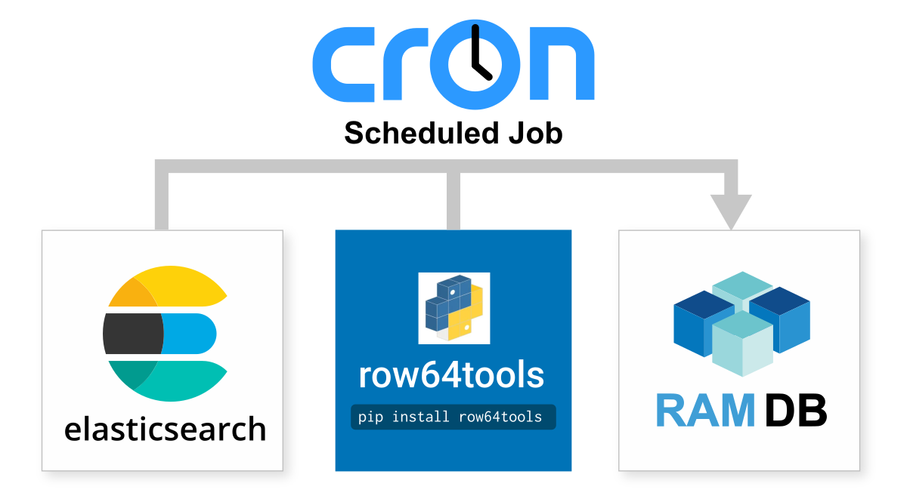

# ElasticSearch Integration

<br>

Elasticsearch is a distributed search engine that specializes in high speed search queries of paragraph text.  It is designed for large datasets and anomaly detection.  ElasticSearch integrates easily with Row64 by wiring to Row64 RamDb through Python.
<br>
## Integration Overview
The basic connection process is to use row64tools to push updates from ElasticSearchto Row64.  An overview is available here:
<br>https://pypi.org/project/row64tools/
<br><br>If sub second speeds are required you might want to look at connecting using real-time streaming which is covered under the streaming help:
<br>https://app.row64.com/Help/V3_5/Install_Docs/Streaming/
<br>
## Continuous Update
Cron jobs are the simple and production proven Linux tool for continous update.  <br>Here's a simple example on how to set them up:<br>https://www.geeksforgeeks.org/linux-unix/how-to-setup-cron-jobs-in-ubuntu/
<br><br>All you need to do is take the integration .py file and setup a cron jobto run it at your data refresh rate, from every day to every 20 seconds.
<br><br>
<br>If your update rate is faster than 60 seconds, be sure to update your row64 config in:
<br>```/opt/row64server/conf/config.json```


so that "RAMDB_UPDATE" is set to match the update speed.

## Install Pip Libraries
To setup ElasticSearch intetgration, install the following pip libraries:
<br>
```
pip install row64tools
pip install pandas
pip install python-dotenv
pip install elasticsearch
```

## Setup For Security
Any security process that works in Python & Linux can be used to secure your data credentials.  Our integration code is written to be easily modified to fit your exact needs.  The default example is to use .env files to set Linux environment variables.  An overview of that approach is here:
<br>https://upsun.com/blog/what-is-env-file/
<br><br>And the most popular Python library for .env is here:
<br>https://pypi.org/project/python-dotenv/
<br><br>The ElasticSearch intetgration code assumes you create a .env file at the same location as your .py file.And it sets the variables: <b>DBHost, DBUsername, DBPassword</b>
<br>
## Download ElasticSearch Integration
Row64 Integrations can be downloaded from the github project:
<br>https://github.com/Row64/row64tools/
<br></b>

The ElasticSearch integration is in the sub-folder:
<br>https://github.com/Row64/row64tools/tree/master/src/row64tools
<br></b>

Note: The integration .py files are intended to be modified or used as a starting point to fit your specific needs and setup.
<br></b>

More help and background information on this database connector can be found at:
<br>https://www.elastic.co/docs/explore-analyze/query-filter/languages/sql<br>

If you have any problem or requests, please log them at:
<br>https://github.com/Row64/row64tools/issues
<br>