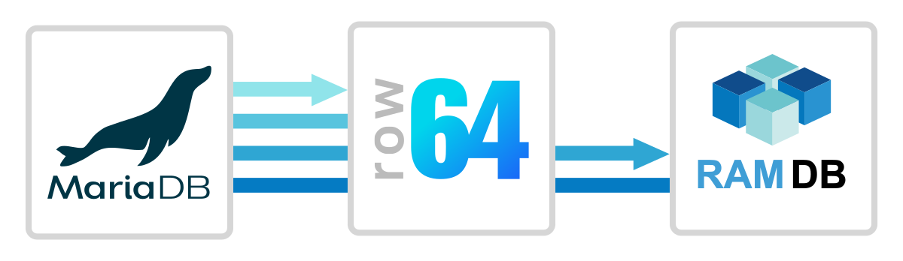
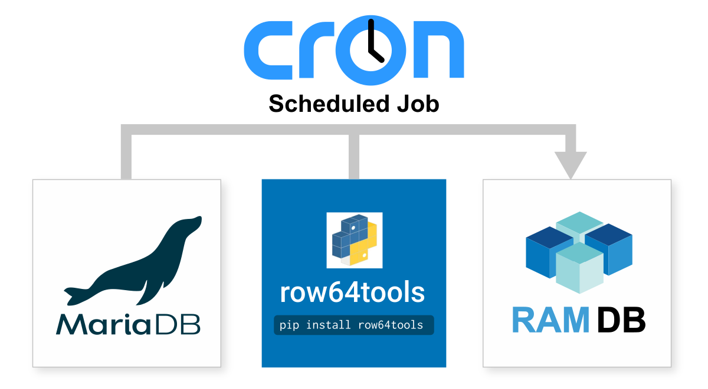

# MariaDB Integration

<br>

MariaDB is a community-developed and open source fork of the MySQL database.  It is known for running some of the largest web sites in the world, including Wikipedia.  MariaDB integrates easily with Row64 by wiring to Row64 RamDb through Python.
<br>
## Integration Overview
The basic connection process is to use row64tools to push updates from MariaDBto Row64.  An overview is available here:
<br>https://pypi.org/project/row64tools/
<br><br>If sub second speeds are required you might want to look at connecting using real-time streaming which is covered under the streaming help:
<br>https://app.row64.com/Help/V3_5/Install_Docs/Streaming/
<br>
## Continuous Update
Cron jobs are the simple and production proven Linux tool for continous update.  <br>Here's a simple example on how to set them up:<br>https://www.geeksforgeeks.org/linux-unix/how-to-setup-cron-jobs-in-ubuntu/
<br><br>All you need to do is take the integration .py file and setup a cron jobto run it at your data refresh rate, from every day to every 20 seconds.
<br><br>
<br>If your update rate is faster than 60 seconds, be sure to update your row64 config in:
<br>```/opt/row64server/conf/config.json```


so that "RAMDB_UPDATE" is set to match the update speed.

## Install Pip Libraries
To setup MariaDB intetgration, install the following pip libraries:
<br>
```
pip install row64tools
pip install pandas
pip install python-dotenv
pip install mariadb
```

## Setup For Security
Any security process that works in Python & Linux can be used to secure your data credentials.  Our integration code is written to be easily modified to fit your exact needs.  The default example is to use .env files to set Linux environment variables.  An overview of that approach is here:
<br>https://upsun.com/blog/what-is-env-file/
<br><br>And the most popular Python library for .env is here:
<br>https://pypi.org/project/python-dotenv/
<br><br>The MariaDB intetgration code assumes you create a .env file at the same location as your .py file.And it sets the variables: <b>DBHost, DBUsername, DBPassword, may have to change port value</b>
<br>

## Integration Example Details

To test the integration and install MariaDb run TEST_SETUP_MariaDb.py with:
```
python TEST_SETUP_MariaDb.py
```

Assumes:
- run in a Ubuntu 24.04 / 25.04 VM or clean install
- you ran Setup_pyenv.py (makes a python that can pip install)

Process:
 - will setup a .env folder in /user/row64/r64tools
 - will install MariaDB with test users
 - will setup needed pip libraries for MariaDb connector
 - will setup an example .env file with: login, password, etc

After you have setup mariadb you can test creating a ramdb file with:

```
python Mariadb.py
```

This example will create a .ramdb file in:
```
/var/www/ramdb/live/RAMDB.Row64/Temp/Test.ramdb
```

You can install ByteStream Viewer to visualize this file.
Ubuntu instructions for that are here:
https://app.row64.com/Help/V3_5/Install_Docs/Streaming/Stream_Install_Ubuntu/#install-bytestream-viewer


From here you can modify the .py file to customize the integration to your specific needs.
