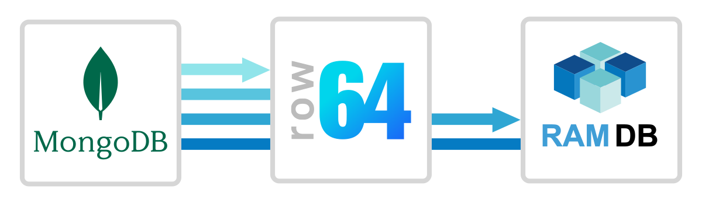
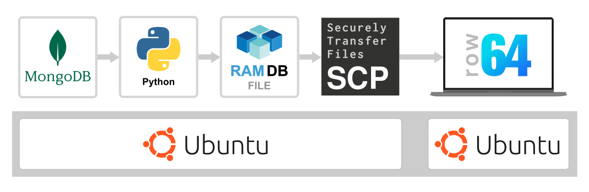
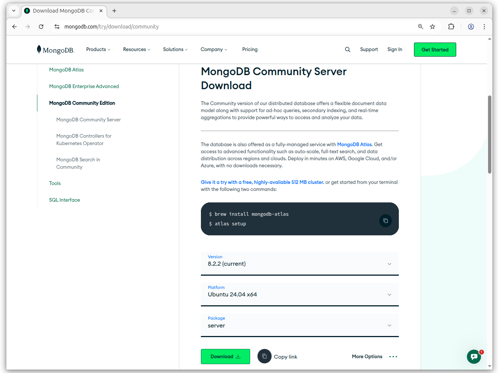
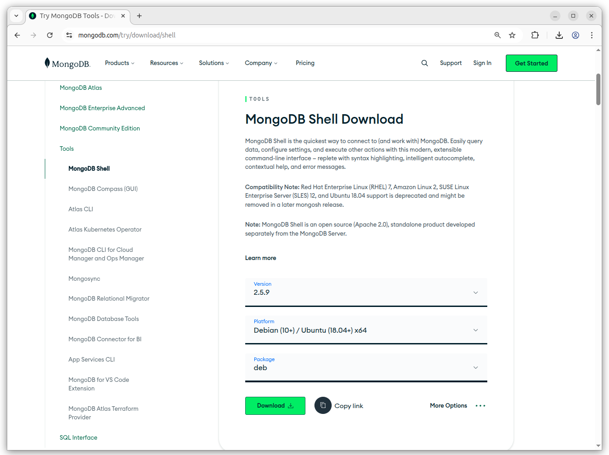
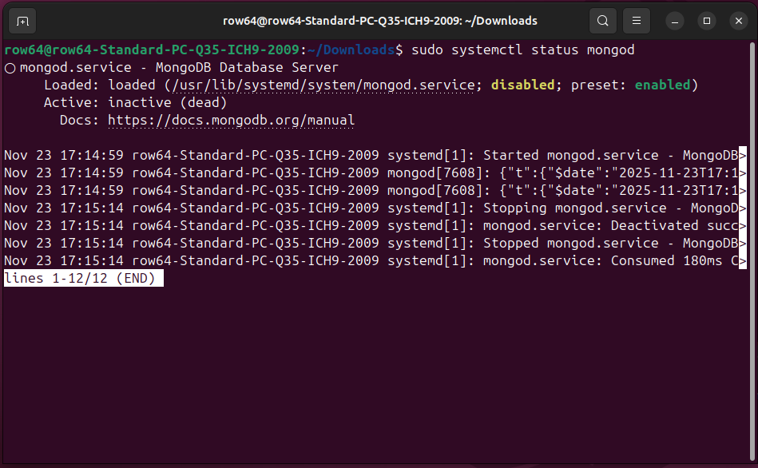
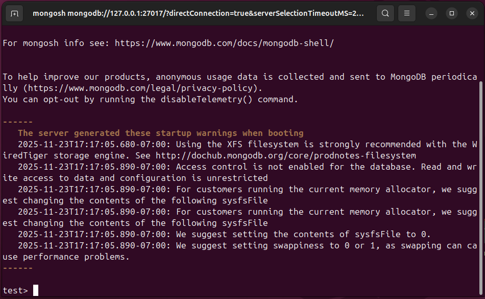
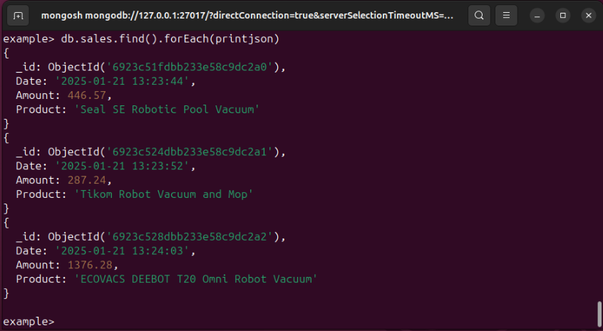
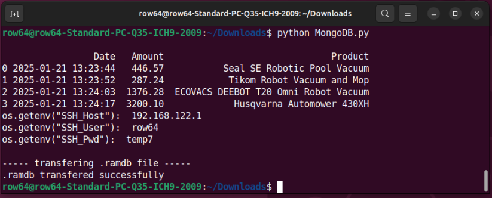
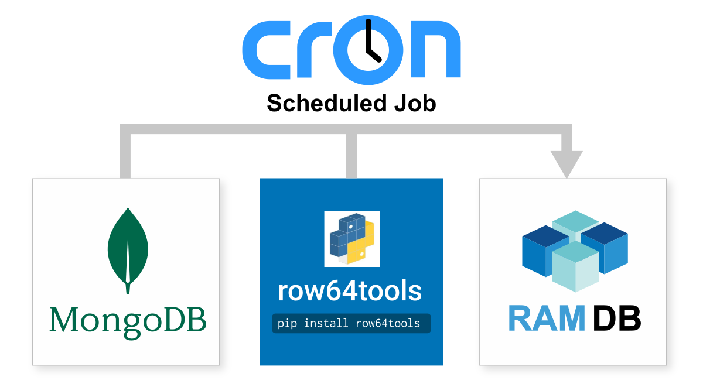

# MongoDB Integration



MongoDB is a JSON-like, NoSQL, document-oriented database.  It is designed with a flexible schema that can handle dynamic changes, new data types, and differing data structures. MongoDB integrates easily with Row64 by wiring to Row64 RamDb through Python.


## Integration Overview

The basic connection process involves using *row64tools* to push updates from MongoDB to Row64.  An overview of row64tools is available here:<br>
[https://pypi.org/project/row64tools/](https://pypi.org/project/row64tools/)

In this guide, you will use Ubuntu as the base operating system, and MongoDB and the Dashboard Server will be located on separate servers or instances. Separating these is optimal for big data enterprise, but for a quick test, you can install both on the same server.



MongoDB and Row64 Server are available on a wide variety of Operating Systems. Although this guide uses Ubuntu, you are not restricted in your choices.

This guide assumes that the Ubuntu user account is named `row64`. On the MongoDB server or instance, you can use any user you want, but be sure to change the paths to fit your environment throughout this example.

For the Row64 Server setup, you will need a `row64` user.


## Download MonogoDB

Download the MongoDB Community Edition:<br>
[https://www.mongodb.com/try/download/community](https://www.mongodb.com/try/download/community)

Find the latest edition for the most recent version of Ubuntu. At the time of writing, the most recent download is: `Ubuntu 24.04 x64`.



On the downloads page, Select Tools on the left navigation pane and find "MongoDB Shell." You will need to download this as well, as it will be used to make the example table. Download the best version to match the Ubuntu version. Currently, it is:<br>
`Debian (10+) / Ubuntu (18.04+) x64`.

If you cannot find MongoDB Shell, use the following link:<br>
[https://www.mongodb.com/try/download/shell](https://www.mongodb.com/try/download/shell)




## Install MonogoDB

After having downloaded the MongoDB installers, navigate to your Downloads filder, open a terminal, and use the following command to install MongoDB:

```
sudo dpkg -i mongodb-org-server_8.2.2_amd64.deb
```

If you downloaded a different version, you can type the first few characters of the installer's name and select the Tab key to auto-complete the name.

After the installation completes, you can view the status of the service with the following command:

```
sudo systemctl status mongod
```



You should see that the service is present, but inactive. To activate the service, use the following command:

```
sudo systemctl start mongod
```


## Install Shell Tools

Install the shell tools that were previously downloaded (MongoDB Shell):

```
sudo dpkg -i mongodb-mongosh_2.5.9_amd64.deb
```

Adjust the installer's name in the command if you have a different version.

Launch MongoDB Shell from the terminal by using the command:

```
mongosh
```



MongoDB may resemble a standard SQL shell in other databases, except it works with JSON instead of SQL.


## Create A Database & Table

Create a database through the MongoDB Shell. If needed, open a terminal and initiate the MongoDB Shell using the steps in the previous section. Use the following command in the MongoDB Shell:

```
use example
```

This command attempts to open ("use") a database named "example." If the "example" database is not found, this command automatically creates it.

MongoDB tables are typically compatible with Pandas DataFrames, which we will utilize for the example dataframe.

Using the following commands, create a table called "sales" and input a simple dataframe into it. Like the database, the table is created when it is referenced, if it doesn't already exist. Enter the following commands one-by-one:

```
db.sales.insertOne( {'Date':'2025-01-21 13:23:44','Amount':446.57,'Product':'Seal SE Robotic Pool Vacuum'} );
```

```
db.sales.insertOne( {'Date':'2025-01-21 13:23:52','Amount': 287.24,'Product':'Tikom Robot Vacuum and Mop'} );
```

```
db.sales.insertOne( {'Date':'2025-01-21 13:24:03','Amount': 1376.28,'Product':'ECOVACS DEEBOT T20 Omni Robot Vacuum'} );
```

```
db.sales.insertOne( {'Date':'2025-01-21 13:24:17','Amount': 3200.10,'Product':'Husqvarna Automower 430XH'} );
```

List the current tables:

```
show collections
```

The sales collection table should be listed. Next, print the dataframe to the terminal:

```
db.sales.find().forEach(printjson)
```



You can also check which port is being used for Python connections by typing:

```
db.serverCmdLineOpts().parsed.net.port
```

Finally, exit the MongoDB shell:

```
exit
```


## Download MongoDB Integration

You can download the Row64 Integration for MongoDB from GitHub:<br>
[https://github.com/Row64/Row64_Integrations/tree/master/MongoDB](https://github.com/Row64/Row64_Integrations/tree/master/MongoDB)

We will use files from this repository to both call the database and to set up a non-OS instance of Python.


## Set Up a Non-OS Python

For working with Python in Ubuntu, when you need to perform pip installations, it's best practice to install a second instance of Python. This will prevent pip dependencies from corrupting Ubuntu system calls.

The simplest way to accomplish this is to install `pyenv`. The following article explains managing multiple instances of Python with `pyenv`, but you do not have to understand this to proceed:<br>
[https://realpython.com/intro-to-pyenv/](https://realpython.com/intro-to-pyenv/)


To simplify the setup, we've automated the `pyenv` installation.  From the root of the integration in [GitHub](https://github.com/Row64/Row64_Integrations/tree/master), download the `Setup_pyenv.py` and run it with:

```
python3 Setup_pyenv.py
```

Once `pyenv` is set up, you can work with the folder specific to the integration to install the needed pip libraries and Python integration, calling `python` instead of the OS-level `python3`. To do this, proceed to the next section.


## Install Python Pip Libraries

Install the Python libraries used to connect to the database and transfer a .ramdb file.  In the terminal, enter the following commands one-by-one:

```
pip install row64tools
```

```
pip install python-dotenv
```

```
pip install pymongo
```

```
pip install paramiko
```

```
pip install scp
```


## Set Up .env For Security

Next, set up a .env file to seperate the login credentials from the .py files. More details on this approach are here:<br>
[https://pypi.org/project/python-dotenv/](https://pypi.org/project/python-dotenv/)

We need to make a directory under the user profile to store the .env file. In this example, the user account is named: `row64`

Make the directory where we are going to store the .env file:

```
mkdir /home/row64/r64tools
```

For this example, this directory will also be used to save .ramdb files. In production, you can modify these paths however you want.

To edit the files, install Sublime, an easy-to-use text editor:

```
sudo snap install sublime-text --classic
```

After Sublime installs, create a `db.env` file and open it in Sublime. Use the following command:

```
subl /home/row64/r64tools/db.env
```

With the file open in Sublime, input the SSH connection credentials that will be used to transfer files to the Row64 Server or instance. This example uses dummy values, so adjust them for your configuration and save the file:

```
SSH_Host=192.168.1.10
SSH_Port=22
SSH_User=row64
SSH_Pwd=temp7
```

!!! tip
    The SSH variables store the credentials to access the server or instance where you want to copy files to, where Row64 Server is installed.

    It is important to use SSH with the `row64` user, so that the files are transferred through a user that has proper access to the dashboard.


## Run the Integration

Run the Python integration you downloaded earlier. In the terminal, type:

```
python MongoDB.py
```

If everything was configured correctly, your terminal's output should resemble the following screenshot:



At the bottom of the output, you should see a message that your .ramdb file transferred successfully.


## Debug and Transfer Problems

When copying the file from the database server to the Dashboard Server, you will need a directory to receive the file. For example, on the receiving server or instance, if you copy the file into the following folder:

```
/var/www/ramdb/loading/RAMDB.Row64/Temp/Test.ramdb
```

Ensure that:
  
  - You made the folder in Linux

  - You copy the file so that the dashboard (user: `row64`) has access to it


## Set Up SSH on Ubuntu 

If you only completed the default Ubuntu installation, it's likely that SSH is not set up on your server or instance.

In Ubuntu, check the list of installed UFW profiles with:

```
sudo ufw app list
```

If OpenSSH is not listed, install it with:

```
sudo apt install openssh-server
```

Enable SSH connections and the firewall:

```
sudo ufw allow OpenSSH
sudo ufw enable
```

!!! note
    This integration routes a SSH login and password in the example .py file.  The setup can be modified for a higher tier of security using a SSH key, which is an access credential in the SSH protocol


## Debug Windows to Linux SSH

If you created the .ramdb file in `C:\r64tools\Test.ramdb` but are not able to copy it over to Ubuntu, debug the port connections with ping and telnet. In the following commands, substitute the example IP addresses with your own hostnames or IPs:

Ping:

```
ping 192.168.1.10
```

Telnet:

```
telnet 192.168.1.10 22
```

For reference, the following article discusses resolving these issues:<br>
[https://stackoverflow.com/questions/14143198/errno-10060-a-connection-attempt-failed-because-the-connected-party-did-not-pro](https://stackoverflow.com/questions/14143198/errno-10060-a-connection-attempt-failed-because-the-connected-party-did-not-pro)


## Test with ByteStream Viewer

Once you see the file copy over to Ubuntu, you can install ByteStream Viewer to visualize the data.

To install ByteStream Viewer on Ubuntu, you can reference the following documentation:<br>
[Install ByteStream Viewer on Ubuntu](../../V3_5/Install_Docs/Streaming/Stream_Install_Ubuntu.md/#install-bytestream-viewer)

You can drag the .ramdb file right into the ByteStream Viewer


Alternatively, you can simply open the file in Row64 Studio.


## Continuous Updates

Cron jobs are the simple and production-proven Linux tool for continuous updates.

The following article provides a simple example on how to set them up:<br>
[https://www.geeksforgeeks.org/linux-unix/how-to-setup-cron-jobs-in-ubuntu/](https://www.geeksforgeeks.org/linux-unix/how-to-setup-cron-jobs-in-ubuntu/)

All you need to do is take the integration .py file and set up a cron job to run it at your data refresh rate, from every day to every 20 seconds.



If your update rate is faster than 60 seconds, be sure to update your row64 config in:<br>
`/opt/row64server/conf/config.json`

