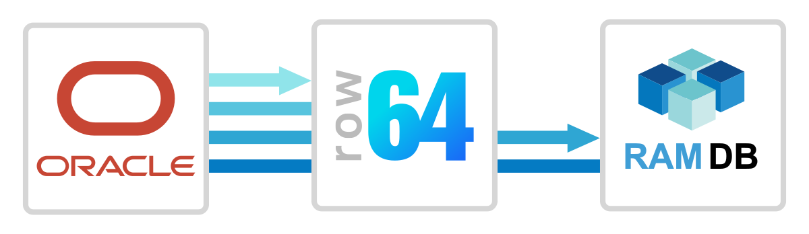
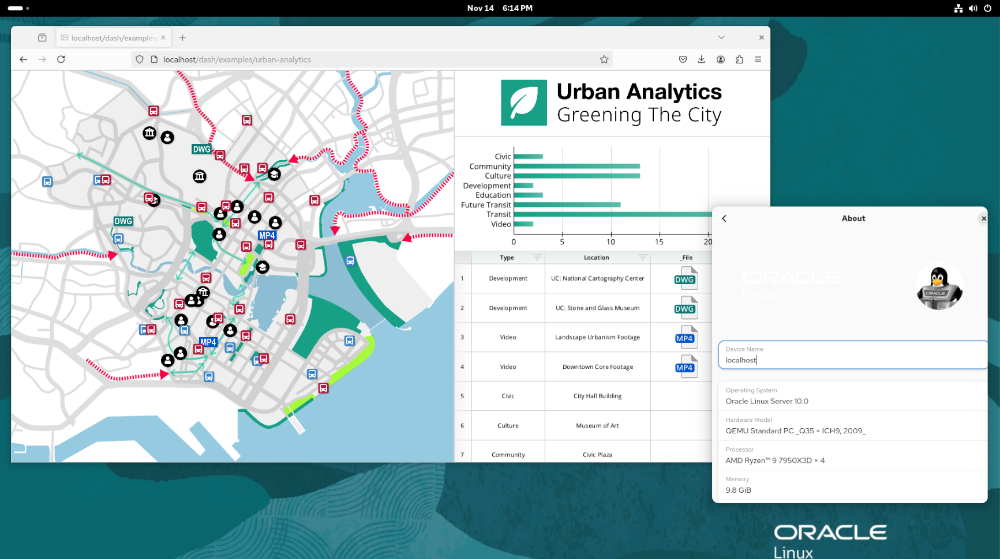
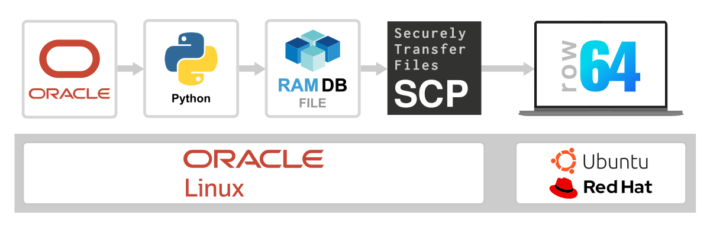
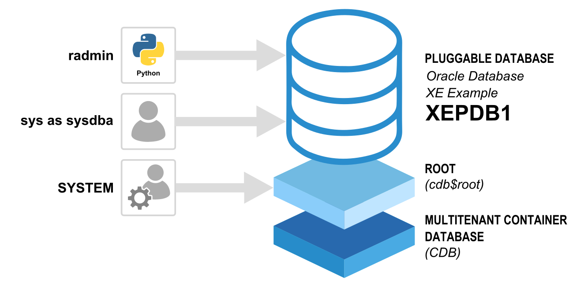
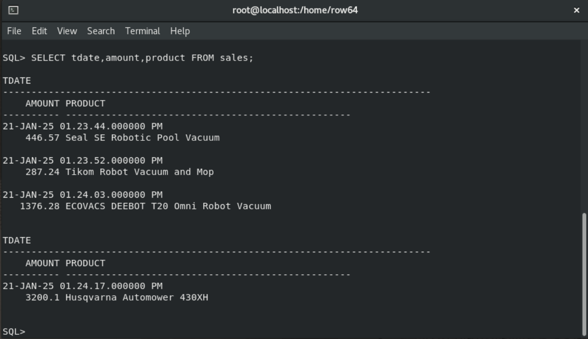
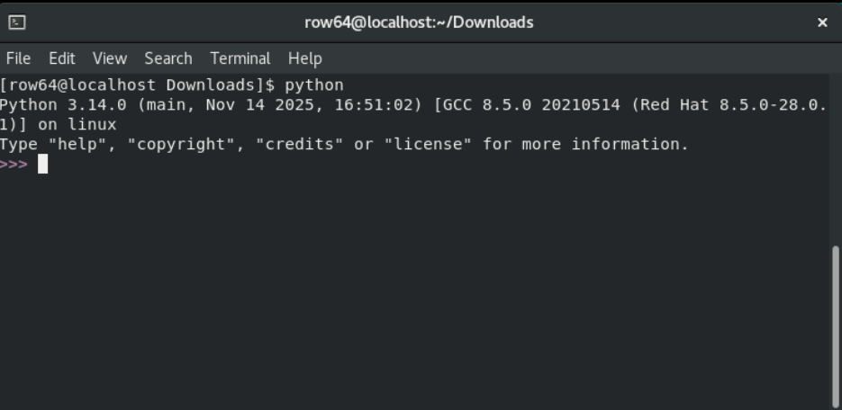
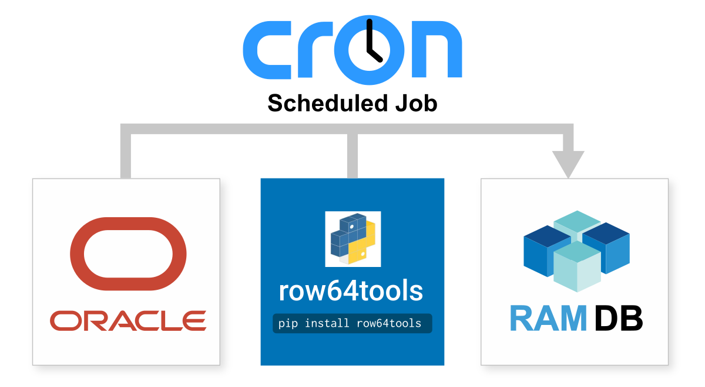

# Oracle Integration

<br>

Oracle was one of the first relational database management systems (RDBMS). It is widely viewed as the most popular enterprise database, and is reputed to be a solid database manager since the 1970s. Oracle integrates easily with Row64 by wiring to Row64 RamDb through Python.
<br>

## Integration Overview

This Oracle Database integration uses Oracle Linux, and moves the data to Ubuntu to serve dashboards.<br>

This approach simplifies security and enables Oracle Server administrators to work in a familiar environment.


## Oracle Linux


<br>

Since this example uses both Oracle Linux and Ubuntu, you might have the question: Why not have both the database and the dashboard run Oracle Linux? The answer is that you can; we've tested it, and it works well.

Here, you can see Row64 Server running on Oracle Linux:



<br>
So, if you're interested in installing Row64 Server on Oracle Linux, just use the RedHat installation found here:<br>
[RedHat Server Install](../../V3_5/Install_Docs/Server/Server_Install_RedHat.md)

<!-- https://app.row64.com/Help/V3_5/Install_Docs/Server/Server_Install_RedHat/ -->

!!! note
    We do not recommend having the database and Dashboard Server on the same server or instance.  Keeping these separated reduces complexity and improves hardware utilization.

<br>

Our standard and simplest setup, shown in this example, is to run the Oracle Database in Oracle Linux, and use SCP to securely transfer the file to the dashboard on Ubuntu.


<br>

An overview on calling an Oracle Database from Python is here:<br>
[https://www.oracle.com/database/technologies/appdev/python/quickstartpythononprem.html#linux-tab](https://www.oracle.com/database/technologies/appdev/python/quickstartpythononprem.html#linux-tab)

The basic connection process is to use row64tools to push updates from an Oracle Database to Row64. An overview is available here:<br>
[https://pypi.org/project/row64tools/](https://pypi.org/project/row64tools/)


An overview of secure file transfer using SCP in Python is described here:<br>
[https://www.tutorialspoint.com/how-to-copy-a-file-to-a-remote-server-in-python-using-scp-or-ssh](https://www.tutorialspoint.com/how-to-copy-a-file-to-a-remote-server-in-python-using-scp-or-ssh)


## Minimal Test Setup

This tutorial shows how to complete a quick test with the Oracle Database XE version. This version is for development tests and non-commercial work. It's expected you'll switch to the commercial Oracle Database Enterprise Edition once you have your test working.  

## Install Oracle Linux

The current version of Oracle Database XE is for Oracle Linux 8.

Download Oracle Linux 8.10 from:<br>
[https://yum.oracle.com/oracle-linux-isos.html](https://yum.oracle.com/oracle-linux-isos.html)

In this example, we will create a user, called row64, with administrative privileges. It's not essential for you to work with this username, but it will simplify this example.

## Install Oracle Database XE

After you have Oracle Linux installed and running, set up the Oracle Database XE pre-install in the terminal with:

```
sudo -s
dnf -y install oracle-database-preinstall-21c
```

Next, go to the Oracle XE software downloads page and download the Linux x64 ( OL8 ) version<br>
[https://www.oracle.com/database/technologies/xe-downloads.html](https://www.oracle.com/database/technologies/xe-downloads.html)

Install it by using the following command:

```
dnf -y localinstall oracle-database-xe-21c-1.0-1.ol8.x86_64.rpm
```

## Set Up an Oracle Database

Set up an Oracle XE database with the default settings:

```
sudo -s
/etc/init.d/oracle-xe-21c configure
```

This will ask you for a single password for the admin accounts;
SYS, SYSTEM, and PDBADMIN.  Use the following as your password:

```
temp7
```

This is a simple password to match the python in this example.

<br>

!!! warning
    Do not maintain this password in the future. After this example is complete, be sure to change it. We recommend that you conform to Oracle's standards. You can find Oracle's recommendations at the following article:<br>
    [https://docs.oracle.com/en/database/oracle/oracle-database/21/dbseg/keeping-your-oracle-database-secure.html#GUID-451679EB-8676-47E6-82A6-DF025FD65156](https://docs.oracle.com/en/database/oracle/oracle-database/21/dbseg/keeping-your-oracle-database-secure.html#GUID-451679EB-8676-47E6-82A6-DF025FD65156)


## Verify Setup is Complete

Once your database setup is complete, it should give you a message that resembles the following example:

```
Connect to Oracle Database using one of the connect strings:
     Pluggable database: localhost.localdomain/XEPDB1
     Multitenant container database: localhost.localdomain
Use https://localhost:5500/em to access Oracle Enterprise Manager for Oracle Database XE

```

## Set Oracle Environment Variables

In the terminal, enter the following lines:

```
sudo -s
export ORACLE_SID=XE 
export ORAENV_ASK=NO 
. /opt/oracle/product/21c/dbhomeXE/bin/oraenv
```

It will return with the following line, which is asking for
the path to ORACLE_HOME:
```
ORACLE_HOME = [] ?
```
Paste the following path as a response:
```
/opt/oracle/product/21c/dbhomeXE
```

It should respond and confirm:
```
The Oracle base has been set to /opt/oracle
```

If you have any issues, a more detailed installation guide for Oracle XE is available here:<br>
[https://docs.oracle.com/en/database/oracle/oracle-database/21/xeinl/installing-oracle-database-free.html#GUID-A5FCC804-5786-4B4B-B1B4-60E36E80B73F](https://docs.oracle.com/en/database/oracle/oracle-database/21/xeinl/installing-oracle-database-free.html#GUID-A5FCC804-5786-4B4B-B1B4-60E36E80B73F)


## Run Oracle From The Terminal

In the terminal, type the following commands:

```
sudo -s
sqlplus SYSTEM/temp7@XE
```

This gives you an SQL Prompt for administration. This example is going to work with a different user, however, so exit the prompt with:

```
EXIT
```

## Create A Pluggable Database User

It is not possible to connect to the database as SYSTEM to create the tables that are accessed from Python. This approach is insecure, so Oracle prevents it. Instead, we will first connect to the example pluggable database (XEPDB1) as `sys as sysdba`. From there, we will create a new user, `radmin`, which will be the account used to create tables and query them from Python.


<br>

Connect to the pre-made example pluggable database. In the terminal, type:

```
sqlplus sys/temp7@//localhost:1521/XEPDB1 as sysdba
```

(Alternatively, the following command is more simple. You can use either the preceding or present command to connect to the XEPDB1, but there's no need to run both):

```
sqlplus sys/temp7@XE as sysdba
```

After connecting to the XEPDB1, create the `radmin` user to access from Python. We will give this user a temporary password: `temp7`

```
create user radmin identified by temp7;
```

Next, grant privileges needed to log in and create tables:

```
grant create table to radmin;
grant create session to radmin;
```

Grant privileges to insert data into tables:

```
alter user radmin quota unlimited on users;
```

Finally, give the full privileges needed for: creating views, creating procedures, and creating sequences.  This is only for our example; in production, you should give users the least amount of privileges they need to operate.
```
grant create view, create procedure, create sequence to radmin;
```

If you have any trouble, more details on this process are available here:<br>
[https://blogs.oracle.com/sql/how-to-create-users-grant-them-privileges-and-remove-them-in-oracle-database](https://blogs.oracle.com/sql/how-to-create-users-grant-them-privileges-and-remove-them-in-oracle-database)


## Create Test Data

We need to create test data for Python to query and transfer to Row64.

In the terminal, log in as the new `radmin` user:

```
sqlplus radmin/temp7@//localhost:1521/XEPDB1
```

Create a new table with test data. Enter each line one at a time:

```
CREATE TABLE sales (tdate TIMESTAMP, amount DECIMAL(15,2), product VARCHAR2(50));
```

```
INSERT INTO sales (tdate,amount,product) VALUES (TIMESTAMP'2025-01-21 13:23:44', 446.57, 'Seal SE Robotic Pool Vacuum');
```

```
INSERT INTO sales (tdate,amount,product) VALUES (TIMESTAMP'2025-01-21 13:23:52', 287.24, 'Tikom Robot Vacuum and Mop');
```

```
INSERT INTO sales (tdate,amount,product) VALUES (TIMESTAMP'2025-01-21 13:24:03', 1376.28, 'ECOVACS DEEBOT T20 Omni Robot Vacuum');
```

```
INSERT INTO sales (tdate,amount,product) VALUES (TIMESTAMP'2025-01-21 13:24:17', 3200.10, 'Husqvarna Automower 430XH');
```

Query some sample data from the table:

```
SELECT tdate,amount,product FROM sales;
```



Exit the SQL Prompt:

```
EXIT
```


## Set Up Python 3.14

Oracle Python Libraries require Python 3.8+, but the current XE version uses Python 3.6. Because of this, we need to install a second Python.

It's also best practice to install a second Python to avoid pip installs corrupting the OS python calls.

For our next step, we will use the standard approach for managing two instances of Python, which is accomplished through pyenv. To get started, install the dependencies for pyenv. Run these in the terminal, one line at a time:

```
sudo yum install libffi-devel -y
```

```
sudo yum install zlib-devel -y
```

```
sudo yum install bzip2-devel -y
```

```
sudo yum install readline-devel -y
```

```
sudo yum install sqlite-devel -y
```

```
sudo yum install wget -y
```

```
sudo yum install llvm -y
```

```
sudo yum install ncurses-devel -y
```

```
sudo yum install openssl-devel -y
```

```
sudo yum install redhat-rpm-config -y
```

```
sudo yum install xz xz-devel -y
```

We'll also need libyaml-devel.  Get this by enabling the "PowerTools" repository equivalent:

```
sudo dnf config-manager --set-enabled ol8_codeready_builder
sudo yum install libyaml-devel -y
```

Our next dependency is the dev tools needed to compile latest Python on install:

```
sudo yum groupinstall "Development Tools" -y
```

Finally, set up git and run the pyenv installer:

```
sudo yum install git -y
curl -L https://github.com/pyenv/pyenv-installer/raw/master/bin/pyenv-installer | bash
```

Append pyenv initializator to your “.bashrc” file:

```
export PATH="~/.pyenv/bin:$PATH"
eval "$(pyenv init -)"
eval "$(pyenv virtualenv-init -)"
```

Source the “.bashrc” file to continue the setup in the same terminal:

```
source ~/.bashrc
```

Install Python 3.14 and set it as the global version:

```
pyenv install 3.14
pyenv global 3.14
```

It might issue a warning about `_tkinter` not installing, but that is
only needed for matplotlib plots, which we will not be using.

!!! tip
    To use the OS Python, use the following command: `python3`<br>
    To use Python 3.14, use the following command: `python`

    Test this by typing the `python` command in the terminal. See the following screenshot.



Type `quit` to exit Python 3.14.


## Install Python Pip Libraries

Install the Python libraries used to connect to the database and transfer a .ramdb file. In the terminal, type:
```
pip install row64tools
pip install python-dotenv
pip install oracledb
pip install paramiko
pip install scp
```

## Set Up .env For Security

Set up a `.env` file to seperate the login credentials from the .py files. More details on this approach are found here:<br>
[https://pypi.org/project/python-dotenv/](https://pypi.org/project/python-dotenv/)

Make a directory to store the `.env` in the user account. This example is using the `row64` user.

```
mkdir /home/row64/r64tools
```

We will also use this directory to save .ramdb files.  Of course,
this is just an example, so you can modify these paths however you want.

Create a `db.env` file and use gedit to modify the content (the following command both creates and opens the file):

```
gedit /home/row64/r64tools/db.env
```

Type in the example setup credentials:

```
DBHost=localhost/xepdb1
DBUser=radmin
DBPwd=temp7
SSH_Host=192.168.1.10
SSH_Port=22
SSH_User=row64
SSH_Pwd=temp7
```
<!-- Replace the SSH values with the login credentials to the server/instance with Row64 Server installed you want to copy the file to. -->

Replace the SSH values with the credentials of your installed instance of Row64 Server that you want to copy files to.

* SSH_Host
* SSH_Port
* SSH_User
* SSH_Pwd


## Download Row64 Oracle Integration

The Row64 integration for Oracle can be downloaded from:<br>
[https://github.com/Row64/Row64_Integrations/tree/master/Oracle](https://github.com/Row64/Row64_Integrations/tree/master/Oracle)

Download the integration and copy the `Oracle_RamDB.py` file into the folder location:

```
/home/row64/r64tools/Oracle_RamDB.py
```

Run the Python integration with:

```
cd /home/row64/r64tools
python Oracle_RamDB.py
```

You should see the example table print to the terminal, and it should output the status of the transfer.


Ensure that, when you transfer the file from Oracle Linux to Ubuntu, you make the directory to recieve the file in advance. For example, if you copy into the
folder:

```
/var/www/ramdb/loading/RAMDB.Row64/Temp/Test.ramdb
```

Make sure:

  * You created the folder in Linux
  
  * You copy the file so that the dashboard (user: row64) has access to it


## Set Up SSH on Ubuntu

If you want to SCP copy into your Ubuntu server with Row64, you need to make sure SSH is installed on it. 

First, check the list of installed UFW profiles with:

```
sudo ufw app list
```

If OpenSSH is not listed, then install it. Ubuntu Desktop versions don’t install with OpenSSH.

```
sudo apt install openssh-server
```

Then, enable SSH connections and the firewall:

```
sudo ufw allow OpenSSH
sudo ufw enable
```

Finally, make sure you have created the loading folder you want to copy into.  More details on how the live folder works are here:<br>
[https://pypi.org/project/row64tools/](https://pypi.org/project/row64tools/)


Here's an example of making a live folder on Ubuntu. Run this as the row64 user:

```
mkdir -p /var/www/ramdb/loading/RAMDB.Row64/Temp
```

!!! warning
    Don't use example or default installation passwords. You can use them for a quick test, but be sure to change them after your test is complete. For best security, use a SSH key, which is an access credential in the SSH protocol.


## Debug SSH to Ubuntu

If you have any problems, you can test the connection directly.  Try the follow tests, replacing the IP or hostname with the server or instance you are connecting to:

```
ping 192.168.1.10
```

and:

```
telnet 192.168.1.10 22
```

If it's not connecting, refer to the following article for more troubleshooting:<br>
[https://stackoverflow.com/questions/14143198/errno-10060-a-connection-attempt-failed-because-the-connected-party-did-not-pro](https://stackoverflow.com/questions/14143198/errno-10060-a-connection-attempt-failed-because-the-connected-party-did-not-pro)

## Test With ByteStream Viewer


Once you see the file copy over to Ubuntu, you can install ByteStream Viewer to visualize the file.

To install ByteStream Viewer on Ubuntu, you can reference the following documentation:<br>
[Install ByteStream Viewer on Ubuntu](../../V3_5/Install_Docs/Streaming/Stream_Install_Ubuntu.md/#install-bytestream-viewer)

<!-- https://app.row64.com/Help/V3_5/Install_Docs/Streaming/Stream_Install_Ubuntu/#install-bytestream-viewer -->

You can drag the .ramdb file directly into ByteStream Viewer.


<br>
Alternatively, you can simply open the file in Row64 Studio.


## Continuous Update

Cron jobs are the simple and production-proven Linux tool for continuous updates.

Here's a simple example on how to set them up:<br>
[https://www.geeksforgeeks.org/linux-unix/how-to-setup-cron-jobs-in-ubuntu/](https://www.geeksforgeeks.org/linux-unix/how-to-setup-cron-jobs-in-ubuntu/)

All you need to do is take the integration .py file and set up a cron job to run it at your data refresh rate, from every day to every 20 seconds.



If your update rate is faster than 60 seconds, be sure to update your row64 config in:

```
/opt/row64server/conf/config.json
```

so that "RAMDB_UPDATE" is set to match the update speed.
