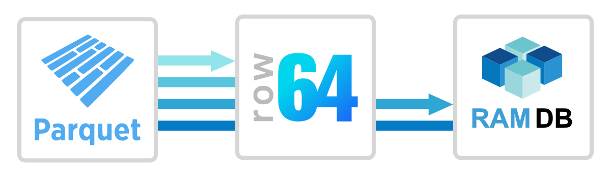
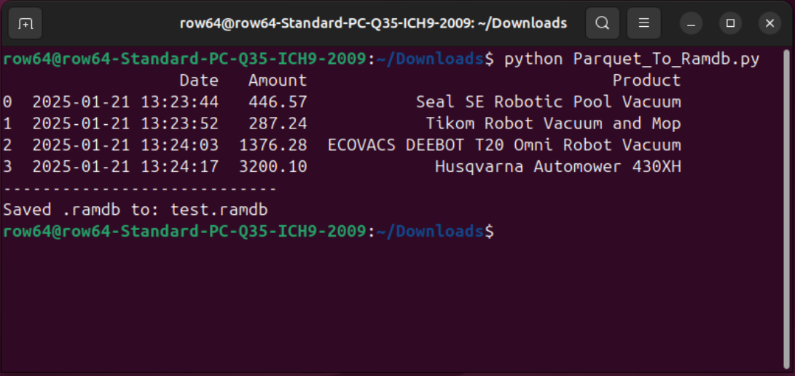
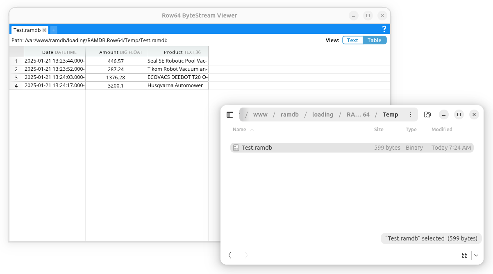

# MongoDB Integration




Apache Parquet is an open source, industry standard data file format for columnar data.  It is widely used in cloud data warehouses and data lakes and supported by many programming languages.  Apache Parquet integrates easily with Row64 by wiring to Row64 RamDb through Python.

## Integration Overview

This is just a simple overview primarily using Python Pandas.

We're going to make a .parquet file, then load it and save it as a .ramdb file.

We'll run the integration in Ubuntu 25.01. 
The general idea of the setup is:
   - copy over .parquet files to Row64 Server
   - convert them into .ramdb and then load the updates into dashboards


## Download the Integration

You can download the Row64 Integration for Parquet in the following
github:<br>
https://github.com/Row64/Row64_Integrations

The full integration is found in the 'Parquet' folder

## Setup A Non-OS Python

For Python work in Ubuntu that requires a pip install, it's best practice to install a second Python.  This will avoid pip dependencies corrupting Ubuntu system calls.

The simplest way to do this is to install pyenv. More details here:<br> https://realpython.com/intro-to-pyenv/


To simplify setup, we've automated pyenv installation.  From the root of the integration, grab Setup_pyenv.py and run it with:
```
python3 Setup_pyenv.py
```

After pyenv is setup, then you can work with the integration specific folder to install the needed pip libraries and python integration, calling 'python' instead of the OS-level 'python3'

## Install Python Pip Libraries

Next install the python libraries used to connect to the database and transfer a .ramdb file.  In the terminal enter them in one-by-one:

```
pip install row64tools
pip install pyarrow
```

## Run the Integration

Run the python integration you downloaded early in the terminal with:

```
python Parquet_To_Ramdb.py
```

If everything worked it should look like this:




## Test with ByteStream Viewer

Once you see the file copy over to Ubuntu, you can install ByteStream Viewer to visualize the data.

To install ByteStream Viewer on Ubuntu, you can reference the following documentation:<br>
[Install ByteStream Viewer on Ubuntu](../../V3_5/Install_Docs/Streaming/Stream_Install_Ubuntu.md/#install-bytestream-viewer)

You can drag the .ramdb file right into the ByteStream Viewer




## Setup A Loading Folder

The final step is to create a loading folder and move
the .ramdb file into there.  This acts as a drop folder where 
the server will grab the file and update all future dashboards.

More details are available here:
https://pypi.org/project/row64tools/


All you need to do is make a directory for loading.  Make sure you do 
this as the row64 user so Row64 has access to the file:

```
mkdir -R /var/www/ramdb/loading/RAMDB.Row64/Temp
```

Next modify the integration .py file so you are writting into
that folder.  Change the line:

```
ramdbPath = 'test.ramdb'
```

to:

```
ramdbPath = '/var/www/ramdb/loading/RAMDB.Row64/Temp/Test.ramdb'
```

And it will automatically move updates into the Row64 server.  Modify the folder name and the .ramdb file name to load different dataframes into different folders.