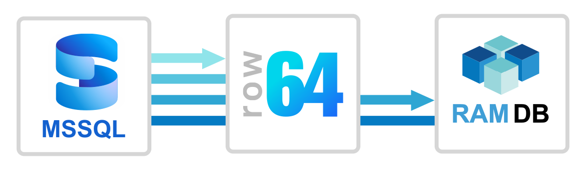
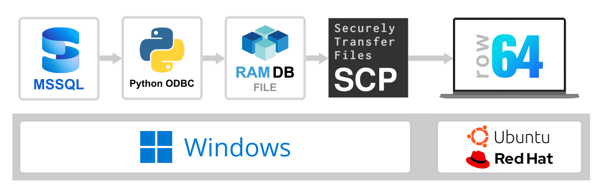
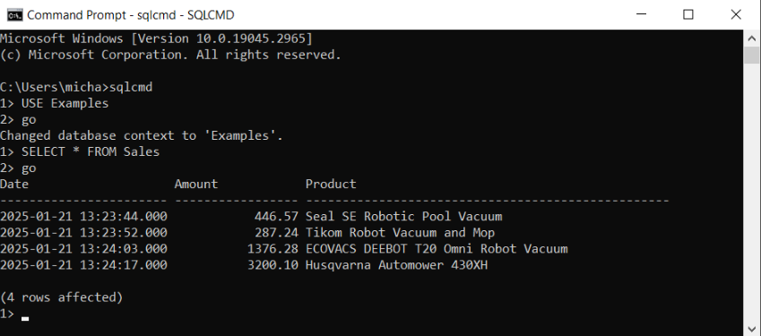
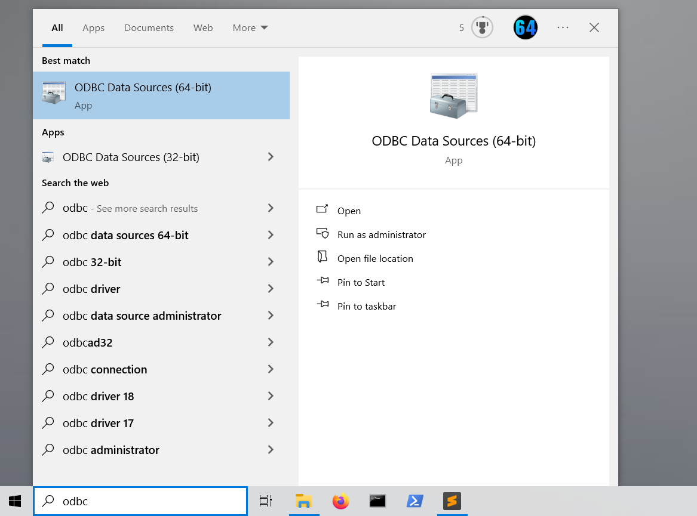
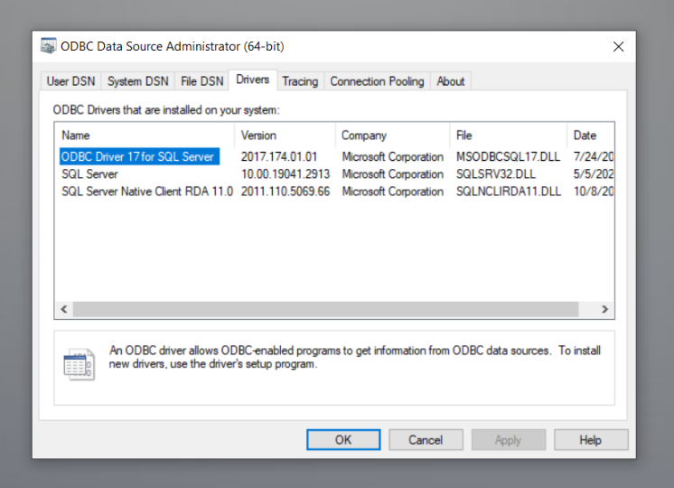
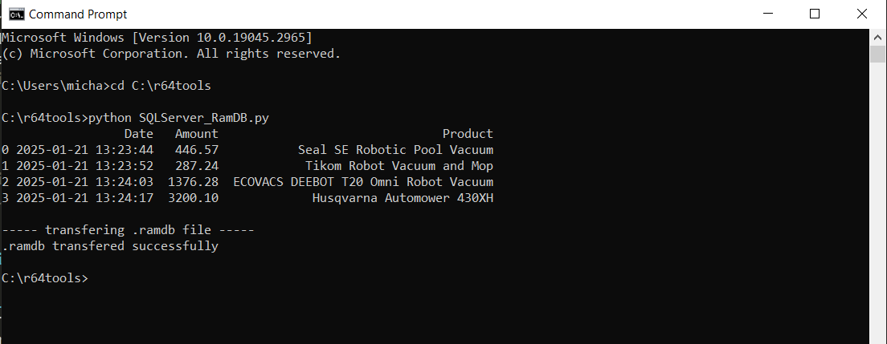
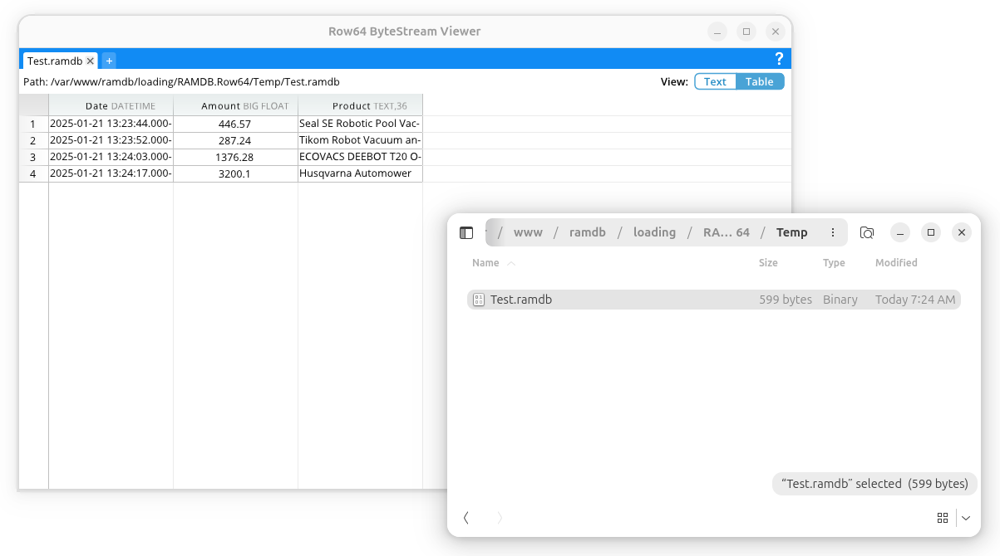
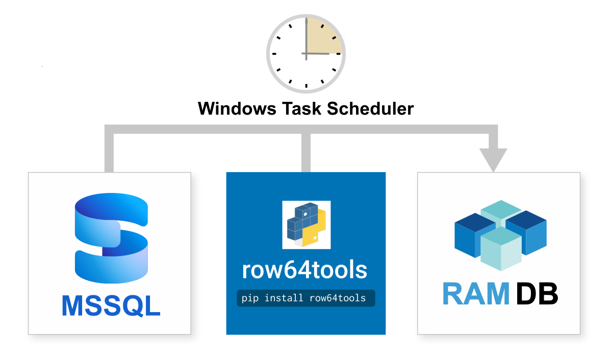

# Microsoft SQL Server Integration


<br>

Microsoft SQL Server is a free, proprietary and relational database management system from Microsoft.  It is widely used and well known for simple integration into Microsoft technology.  Microsoft SQL Server integrates easily with Row64 by wiring to Row64 RamDb through Python.
<br>
## Integration Overview

SQL Server integration is primarily completed on the Windows platform, but as a last step, the data is moved to Linux for Dashboard Evaluation. This method simplifies Windows Authentication, and allows Windows Server Administrators to work in a familiar environment.



The following link provides an overview on using Python ODBC to gather queries from SQL Server:<br>
[https://learn.microsoft.com/en-us/sql/connect/python/pyodbc/python-sql-driver-pyodbc-quickstart?view=sql-server-ver17&tabs=azure-sql](https://learn.microsoft.com/en-us/sql/connect/python/pyodbc/python-sql-driver-pyodbc-quickstart?view=sql-server-ver17&tabs=azure-sql)

The basic connection process is to use row64tools to push updates from Microsoft SQL Server to Row64. An overview is available here:<br>
[https://pypi.org/project/row64tools/](https://pypi.org/project/row64tools/)

An overview of secure file transfer using SCP in Python is described here:<br>
[https://www.tutorialspoint.com/how-to-copy-a-file-to-a-remote-server-in-python-using-scp-or-ssh](https://www.tutorialspoint.com/how-to-copy-a-file-to-a-remote-server-in-python-using-scp-or-ssh)


## Setup For Security

This integration example uses .env files to set Linux seperatly from the integration .py files.  An overview of that approach is here:<br>
[https://upsun.com/blog/what-is-env-file/](https://upsun.com/blog/what-is-env-file/)

More details on the most popular Python library for .env is here:<br>
[https://pypi.org/project/python-dotenv/](https://pypi.org/project/python-dotenv/)

This integration example assumes a .env file setup in:
```
C:\r64tools\db.env
```

You can modify the location and the python script as needed.<br><br>

## Minimal Example Setup 

Here's a simple example of testing this integration.  It includes:

 * A single Windows PC/Instance with SQL Server installed

 * A single Ubuntu PC/Instance with Row64 Server installed

 We'll query SQL Server from Python using ODBC drivers, save a .ramdb file, and move it over to Ubuntu.


## Install Python on Windows 

To start, install the latest version of Python from:<br>
[https://www.python.org/downloads/](https://www.python.org/downloads/)


<br>
It is easier to download and run the Python install manager because it installs all the environment variable to run Python from the command line.

## SQL Server Install Wizard 

For a minimal testing setup, just use the install wizard for
installation.  An overview is here:<br>
[https://learn.microsoft.com/en-us/sql/database-engine/install-windows/install-sql-server-from-the-installation-wizard-setup?view=sql-server-ver17](https://learn.microsoft.com/en-us/sql/database-engine/install-windows/install-sql-server-from-the-installation-wizard-setup?view=sql-server-ver17)

Downloads are here:<br>
[https://www.microsoft.com/en-us/sql-server/sql-server-downloads](https://www.microsoft.com/en-us/sql-server/sql-server-downloads)

Download the "SQL Server 2022 Developer" version for a free testing version.

Run the installer, pick "Basic Install," and keep all the default options.

## Create a Test Database 

Now, create a simple test database from the command line.<br>
Open up a Windows Command Prompt and type:
```
sqlcmd
```

You can now enter SQL commands.  To input the command,
you type "go" after each line.  Enter in a simple test:
```
CREATE DATABASE Examples;
go
USE Examples;
go
CREATE TABLE Sales (Date DATETIME, Amount DECIMAL(15,2), Product VARCHAR(50));
go
INSERT INTO Sales VALUES ("2025-01-21 13:23:44", 446.57, "Seal SE Robotic Pool Vacuum");
go
INSERT INTO Sales VALUES ("2025-01-21 13:23:52", 287.24, "Tikom Robot Vacuum and Mop");
go
INSERT INTO Sales VALUES ("2025-01-21 13:24:03", 1376.28, "ECOVACS DEEBOT T20 Omni Robot Vacuum");
go
INSERT INTO Sales VALUES ("2025-01-21 13:24:17", 3200.10, "Husqvarna Automower 430XH");
go
```

If you want to see the Example database in the command line, type:
```
USE Examples;
go
SELECT * FROM Sales; 
go
```


## Set Up Python Dependencies 

Next, let's set up all the Python pip libraries needed for the integration.  In the Command Prompt, type in:
```
python -m pip install row64tools
python -m pip install pandas
python -m pip install python-dotenv
python -m pip install pyodbc
python -m pip install paramiko
python -m pip install scp
```

Next, create our .env file in the command prompt and open it in Notepad.  We can also use this directory to save .ramdb files.
Type in the following commands in Command Prompt:
```
mkdir C:\r64tools
cd C:\r64tools
.>db.env 2>NUL
notepad db.env
```

Enter the following sample setup options into Notepad:
```
DBHost=localhost
DBUser=admin
DBPwd=#8976S#Dfs
SSH_Host=192.168.1.10
SSH_Port=22
SSH_User=row64
SSH_Pwd=temp7
```

You can update this later with the exact data for your setup.  It is important to use SSH with the row64 user so that you transfer the files with a user that has row64server access.

!!! note
    Once your test version is validated, don't use example or default installation passwords.  

You'll need to download the Row64 integration to SQL Server from Github:<br>
[https://github.com/Row64/Row64_Integrations/tree/master/SQLServer](https://github.com/Row64/Row64_Integrations/tree/master/SQLServer)
<br></b>

Copy the `SQLServer_RamDB.py` test file into the folder:
```
C:\r64tools
```

## Open ODBC Data Source Driver 

Windows ships with ODBC Data Sources installed. You can open it from the Run menu:




<br>

Take note of the exact name of the ODBS driver in the Drivers tab. You will use this name in the connection string.




The connection string in the example .py connects to localhost using Windows login authentication:

```
conn = pyodbc.connect('''Driver=ODBC Driver 17 for SQL Server;Server=localhost;Database=Examples;Trusted_Connection=yes;''')
```

For more complex setups, you'll need to change that string based on your authentication, server, and login details.

## Call SQL Server from Python 

With the integration installed, you can run the `SQLServer_RamDB.py` from the terminal and see the database print out:
```
cd C:\r64tools
python SQLServer_RamDB.py
```
<br>


## Verify File Transfer is Working 
When you ran `SQLServer_RamDB.py`, it attempted to SCP transfer the new .ramdb file to the server specified in: 
```
C:\r64tools\db.env
```

For this to work, it is important to verify the file is set up correctly.

Additionally, on the Ubuntu machine you are copying to, make sure you've installed Row64 Server.  You will also need to make the loading folder that recieves your .ramdb file.  

For this minimal example, use the following command to create the needed folder at the specified location:

```
mkdir -p /var/www/ramdb/loading/RAMDB.Row64/Temp
```

Also, it's best to set
```
SSH_User=row64
```
so that when the file copies in, the service row64server has access to it.

## Set Up SSH on Ubuntu 

If you only completed the default Ubuntu install, it's likely that SSH is not set up on your server or instance.

In Ubuntu, check the list of installed UFW profiles with:
```
sudo ufw app list
```
If OpenSSH is not listed, install it with:
```
sudo apt install openssh-server
```
Enable SSH connections and the firewall:
```
sudo ufw allow OpenSSH
sudo ufw enable
```

!!! note
    This integration routes a SSH login and password in the example .py file.  The setup can be modified for a higher tier of security using a SSH key, which is an access credential in the SSH protocol

## Debug Windows to Linux SSH

If you are making the .ramdb file in
```
C:\r64tools\Test.ramdb 
```
but are not able to copy it over to Ubuntu, you can debug the port connections with ping (sub in your hostname/IP):
```
ping 192.168.1.10
```
and also telnet:
```
telnet 192.168.1.10 22
```
For reference, the following article discusses resolving these issues:<br>
[https://stackoverflow.com/questions/14143198/errno-10060-a-connection-attempt-failed-because-the-connected-party-did-not-pro](https://stackoverflow.com/questions/14143198/errno-10060-a-connection-attempt-failed-because-the-connected-party-did-not-pro)


## Test with ByteStream Viewer

Once you see the file copy over to Ubuntu, you can install ByteStream Viewer to visualize the file.

To install ByteStream Viewer on Ubuntu, you can reference the following documentation:<br>
[Install ByteStream Viewer on Ubuntu](../../V3_5/Install_Docs/Streaming/Stream_Install_Ubuntu.md/#install-bytestream-viewer)

You can drag the .ramdb file right into the ByteStream Viewer



<br>
Alternatively, you can simply open the file in Row64 Studio.

## Continuous Update

On Windows, Task Scheduler is the production-proven tool for establishing continuous updates.  Here's a simple example on how to set it up:<br>
[https://www.windowscentral.com/how-create-automated-task-using-task-scheduler-windows-10](https://www.windowscentral.com/how-create-automated-task-using-task-scheduler-windows-10)



You simply need to take the integration .py file and set up a cron job to run at your data refresh rate, which can range from every 20 seconds to every day.

