# Snowflake Integration

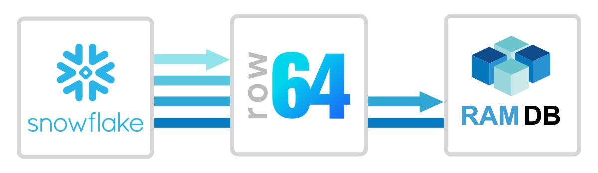

Snowflake is a cloud-native data platform known for lighting-speed queries of a columnar-stored data warehouse.  It is well known for its low-latency execution of big data workloads. Snowflake integrates easily with Row64 by wiring to Row64 RamDb through Python.


## Integration Overview

In this integration, we will construct a database and table using Snowsight, the Snowflake Web Interface. Then, we'll use Python to transfer the data from the Snowflake Cloud into Row64 Server.


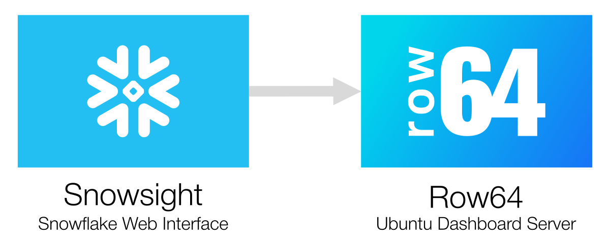


## Test With the Free Version

If you do not already have a Snowflake account, you can create one for free and gain access to a trial version of the product. This example will use the free trial version to simplify the process of conducting a quick test. If you already have an enterprise account, you can run a test or proof of concept outside your normal working environment.

You can sign up for a free Snowflake account here:<br>
[https://signup.snowflake.com/](https://signup.snowflake.com/)

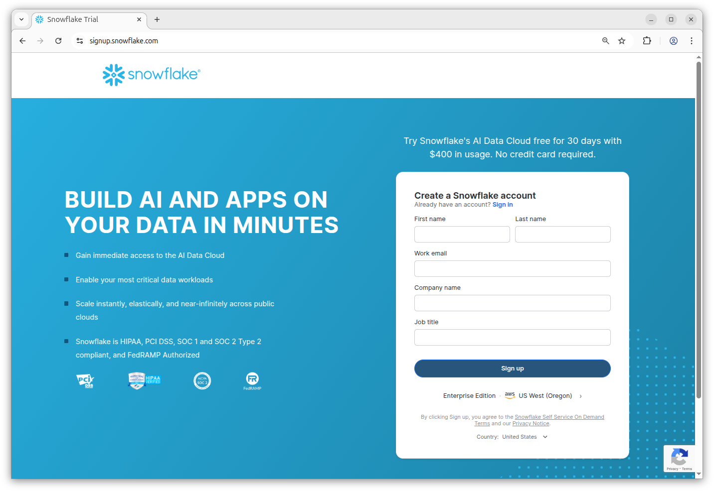


## Download the Integration

Download the Row64 integration for Snowflake from GitHub:<br>
[https://github.com/Row64/Row64_Integrations/tree/master/Snowflake](https://github.com/Row64/Row64_Integrations/tree/master/Snowflake)

Find the `Sales.csv` file in the downloaded folder and upload it to Snowflake by dragging it into the drag target in the browser.

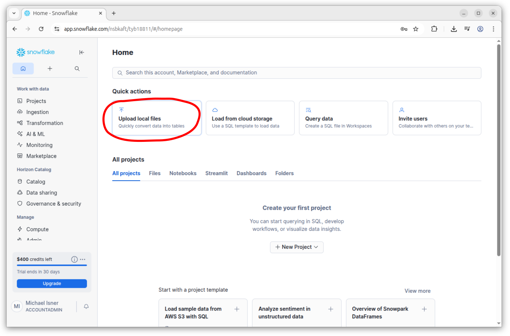

Next, click the "+ Database" icon to add a new database.

Name the database "Example" and click "Create."

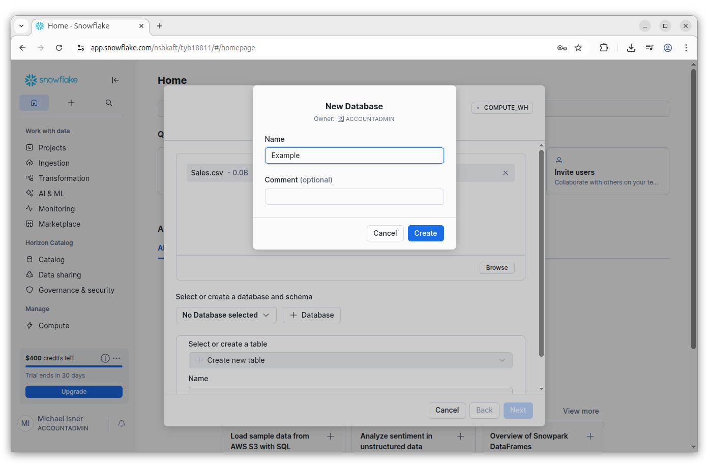

A new table will be created based on the uploaded `Sales.csv` file. Name this table "Sales."

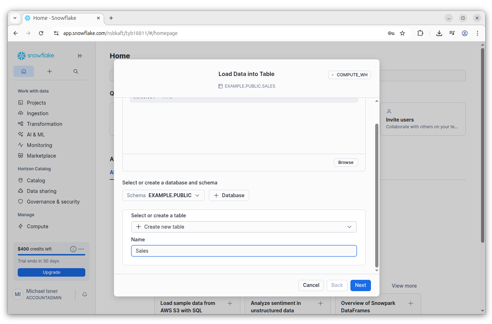

Click the Next button. Snowflake will automatically determine the data types, including the TimeStamp. Click the Load button.

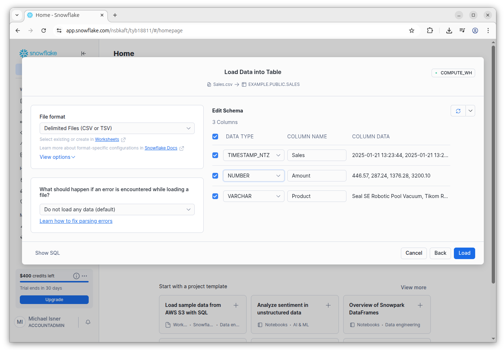

You should see a green check mark icon and a message that confirms that the data was successfully loaded. Next, click "Generate SQL from table."

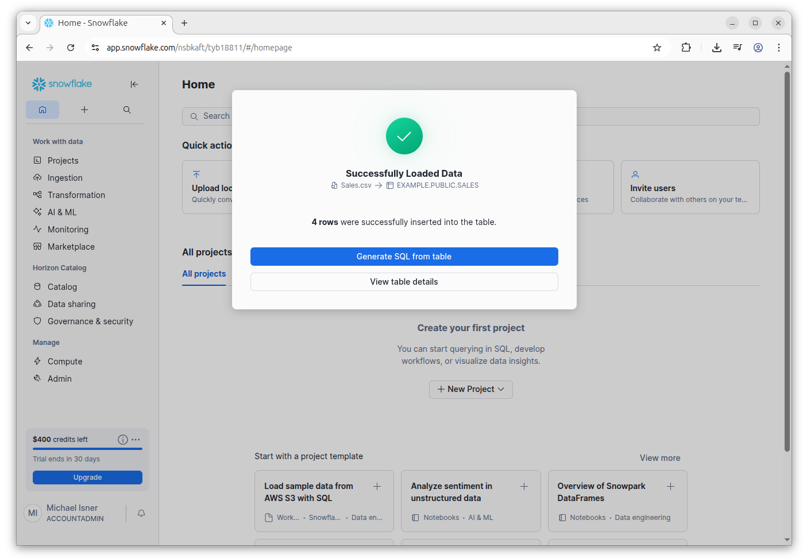

After selecting the option, you will be directed to Snowflake Workspaces. Find the Database Explorer navigation in the bottom left and expand the details on the new SALES table.

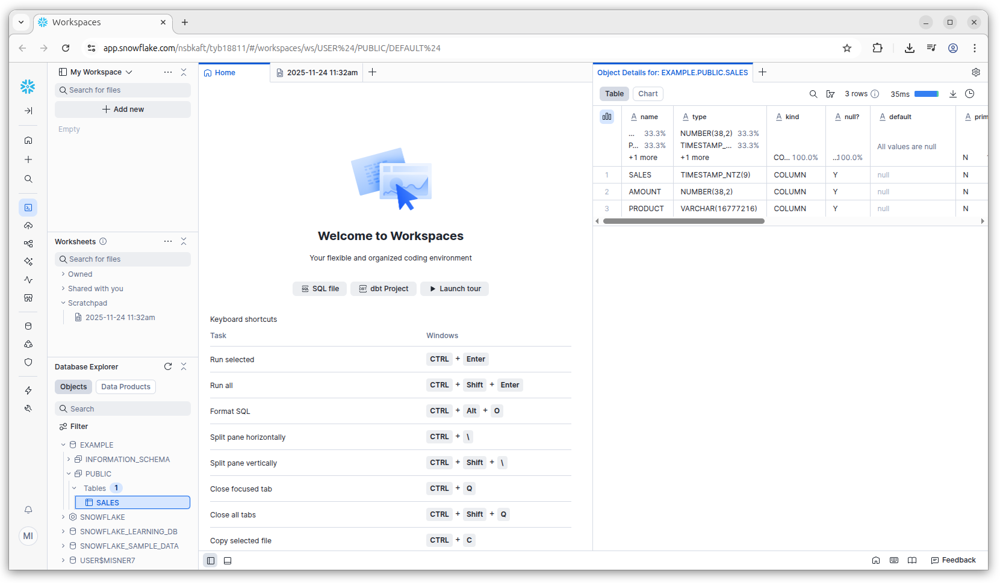


## Connect a Tool to Snowflake

We now need to configure Snowflake so Python can connect to it.

Log into SnowSight (the main UI you see when trying to sign in) and find the user button at the bottom left, which will display your profile picture and username.

Click on the user button and select "Connect a tool to Snowflake."

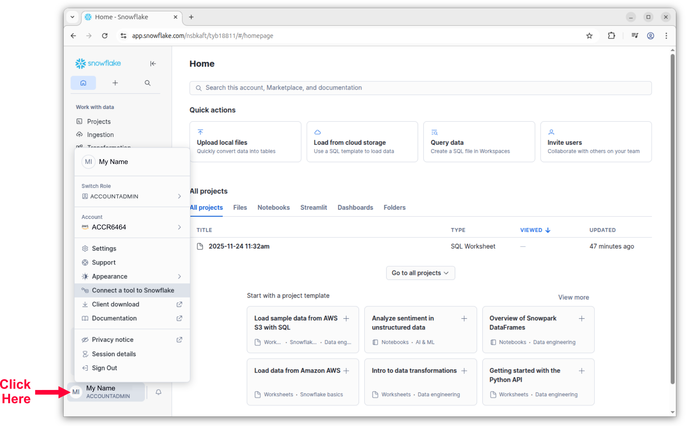

On the Account tab of the Account Details window, you will see a list of account information. You will use this information to configure the .env file in the next step.

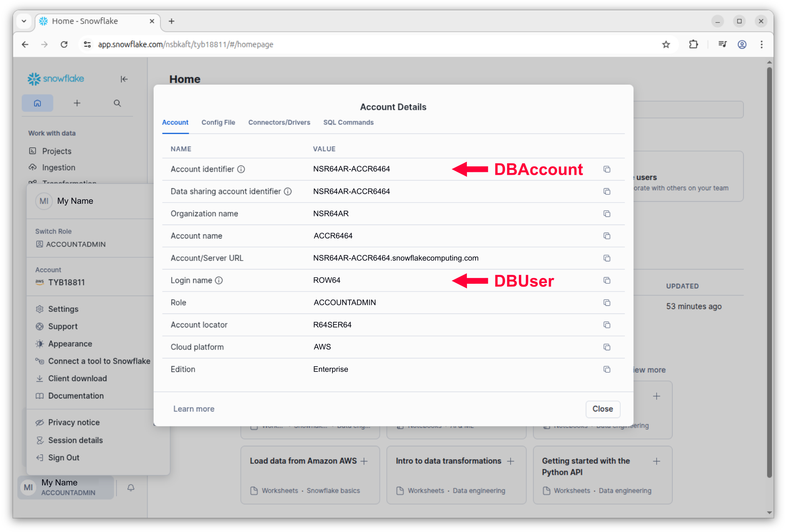

If you need more help getting credentials for connecting Python to Snowflake, here's a link with additional information:<br>
[https://docs.snowflake.com/en/user-guide/gen-conn-config](https://docs.snowflake.com/en/user-guide/gen-conn-config)


## Set Up .env For Security

Go to the Ubuntu server or instance you have Row64 Server on.

In this example, you will configure a .env file to separate the login credentials from the Python .py files. For further reading, more details on this approach are available at:<br>
[https://pypi.org/project/python-dotenv/](https://pypi.org/project/python-dotenv/)

A directory under the `row64` user account is needed to store the .env file. (This example assumes you are logged in with a user account named `row64`).

Use the following command to create the directory under the `row64` user account:

```
mkdir /home/row64/r64tools
```

This directory will also be used to save .ramdb files, but this is not required; you can modify these paths and save the .ramdb files elsewhere, if desired.

To edit the files, install Sublime, which is an easy-to-use text editor:

```
sudo snap install sublime-text --classic
```

After Sublime installs, use the following command to create and open a `db.env` file:

```
subl /home/row64/r64tools/db.env
```

With the file open in Sublime, input the DBAccount (Account identifier), DBUser (Login name), and DBPwd Snowflake credentials from the previous "Connect a tool to Snowflake" step. The following example uses dummy values, so replace them with your configuration information:

```
DBAccount=NSR64AR-ACCR6464
DBUser=ROW64
DBPwd=temp7temp7!
```

Save and close the file. You are now ready to securely access the credentials from Python. Using this method helps prevent unintentionally sharing credentials or uploading them to GitHub.

Next, you will need to convert the Snowflake database into a .ramdb file, which will be loaded into the running Dashboard Server. This is the simplest approach. For high update speeds, consider [streaming](../../V3_5/Install_Docs/Streaming/index.md).

To set up the .ramdb transfer, make sure you have created the loading folder you want to transfer the file to. For further reading, you can find more information on how the live folder works at:<br>
[https://pypi.org/project/row64tools/](https://pypi.org/project/row64tools/)

The following is an example of creating the loading folder. The location can change depending on which folder you want to transfer the .ramdb file to. We will use the folder specified in the command for testing, and this also aligns with the example .py file:

```
mkdir -p /var/www/ramdb/loading/RAMDB.Row64/Temp
```

## Set Up a Non-OS Python

For working with Python in Ubuntu, when you need to perform pip installations, it's best practice to install a second instance of Python. This will prevent pip dependencies from corrupting Ubuntu system calls.

The simplest way to accomplish this is to install `pyenv`. The following article explains managing multiple instances of Python with `pyenv`, but you do not have to understand this to proceed:<br>
[https://realpython.com/intro-to-pyenv/](https://realpython.com/intro-to-pyenv/)


To simplify the setup, we've automated the `pyenv` installation.  From the root of the integration in [GitHub](https://github.com/Row64/Row64_Integrations/tree/master), download the `Setup_pyenv.py` and run it with:

```
python3 Setup_pyenv.py
```

Once `pyenv` is set up, you can work with the folder specific to the integration to install the needed pip libraries and Python integration, calling `python` instead of the OS-level `python3`. To do this, proceed to the next section.


## Install Python Pip Libraries

Next, install the Python libraries used to connect to the database and transfer a .ramdb file. In the terminal, enter the following commands one-by-one:

```
pip install row64tools
```

```
pip install python-dotenv
```

```
pip install snowflake-connector-python
```

For further reading, more details on the Snowflake Python Connector are available at:<br>
[https://docs.snowflake.com/en/developer-guide/python-connector/python-connector-install](https://docs.snowflake.com/en/developer-guide/python-connector/python-connector-install)


## Run the Integration Python

Run the Python integration you downloaded earlier:

```
python Snowflake.py
```

If everything is working, you will see the Sales table logged as a Pandas DataFrame.

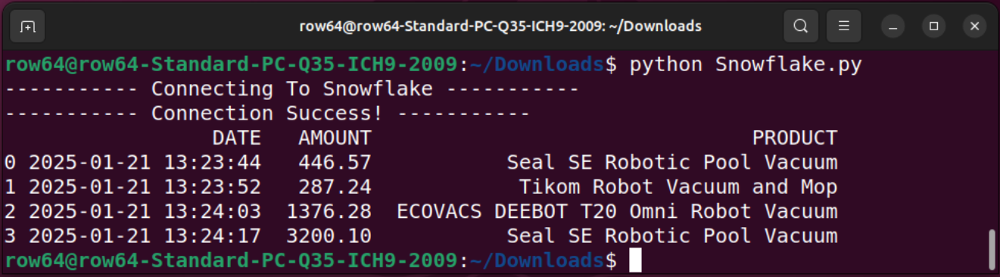


## Test With ByteStream Viewer

If the loading folder is set up correctly, and everything is working, the .ramdb file should be present at:

```
/var/www/ramdb/loading/RAMDB.Row64/Temp/Test.ramdb
```

If the script worked, but you don't see the .ramdb file, it may have already moved to the live folder:

```
/var/www/ramdb/live/RAMDB.Row64/Temp/Test.ramdb
```

If this is the case, make a copy of the file and save it in a different folder. From there, you can test with ByteSteam Viewer.

To install ByteStream Viewer on Ubuntu, you can reference the following documentation:<br>
[Install ByteStream Viewer on Ubuntu](../../V3_5/Install_Docs/Streaming/Stream_Install_Ubuntu.md/#install-bytestream-viewer)


Alternatively, you can simply open the file in Row64 Studio.


## Continuous Updates

Cron jobs are the simple and production-proven Linux tool for continuous updates.

The following article provides a simple example on how to set them up:<br>
[https://www.geeksforgeeks.org/linux-unix/how-to-setup-cron-jobs-in-ubuntu/](https://www.geeksforgeeks.org/linux-unix/how-to-setup-cron-jobs-in-ubuntu/)

All you need to do is take the integration .py file and set up a cron job to run it at your data refresh rate, from every day to every 20 seconds.

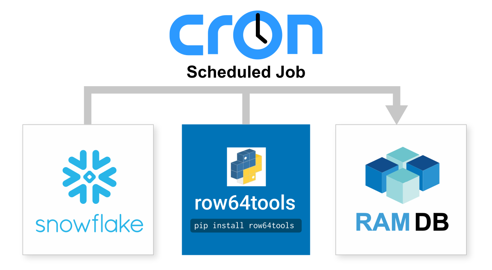